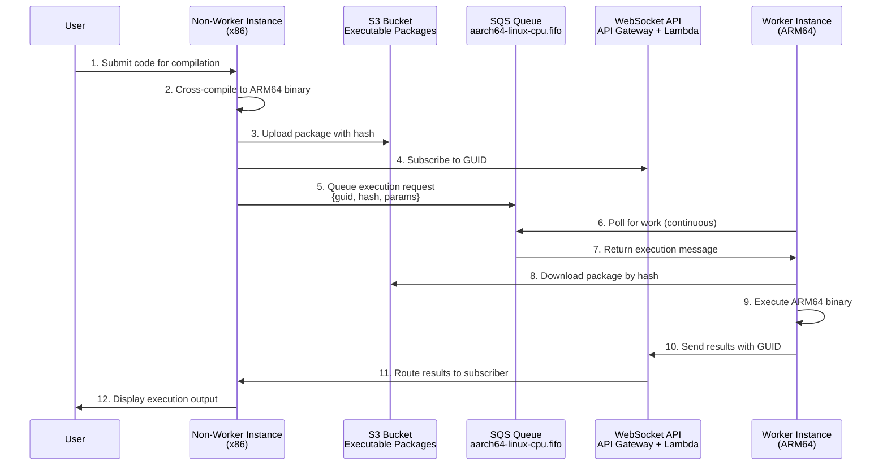
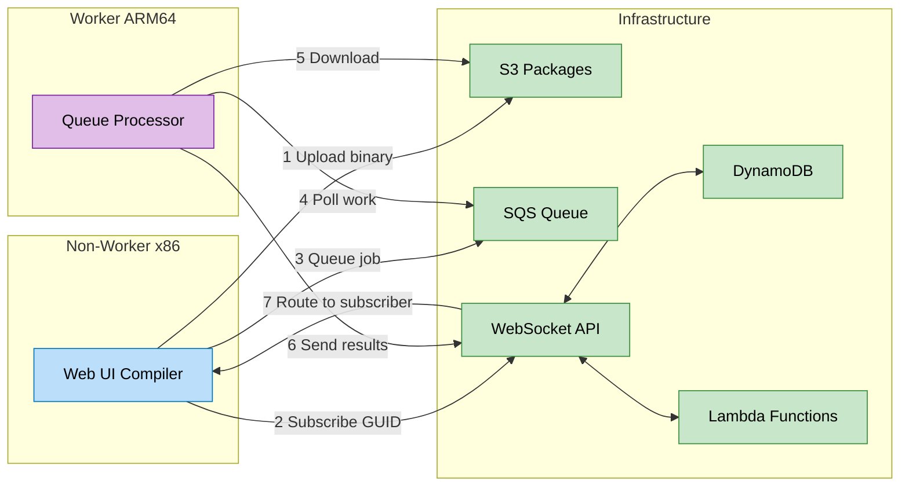

# AArch64 Execution Workflow and Architecture

## Overview

Compiler Explorer implements a sophisticated distributed execution model for AArch64 (ARM64) architectures. Unlike traditional environments where compilation and execution happen on the same instance, AArch64 uses a **split architecture** where x86 instances handle compilation and user interaction, while dedicated ARM64 instances handle execution in worker mode.

This document describes the complete workflow, architecture, and operational model for AArch64 execution in Compiler Explorer.

## Simplified Use-Case Flow



### Key Interactions Explained

1. **User → Non-Worker**: User submits code for compilation and execution
2. **Non-Worker → S3**: Compiled ARM64 binary packaged and uploaded with unique hash
3. **Non-Worker → WebSocket**: Subscribes to GUID to receive results
4. **Non-Worker → SQS**: Execution request queued with GUID, package hash, and parameters
5. **Worker → SQS**: Polls queue for execution requests (continuous)
6. **Worker → S3**: Downloads executable package using hash from message
7. **Worker → Local**: Executes ARM64 binary in native environment
8. **Worker → WebSocket**: Sends execution results with GUID
9. **WebSocket → Non-Worker**: Routes results to subscriber based on GUID
10. **Non-Worker → User**: Displays execution output

## Architecture Comparison

### Traditional Single-Instance Model

```
┌─────────────────────────────────────────────────────────────────────────┐
│                    Traditional Environment (x86)                        │
├─────────────────────────────────────────────────────────────────────────┤
│                                                                         │
│  [User Request] → [Compilation] → [Local Execution] → [Results]         │
│                        │                │                               │
│                        ↓                ↓                               │
│                   [Same Instance]   [Same Instance]                     │
│                                                                         │
└─────────────────────────────────────────────────────────────────────────┘
```

### AArch64 Split Architecture Model

```
┌─────────────────────────────────────────────────────────────────────────┐
│                        AArch64 Split Architecture                       │
├─────────────────────────────────────────────────────────────────────────┤
│                                                                         │
│ ┌─────────────────────┐                    ┌─────────────────────┐      │
│ │   x86 Instances     │                    │ AArch64 Instances   │      │
│ │  (Main/Requesters)  │                    │   (Workers)         │      │
│ ├─────────────────────┤                    ├─────────────────────┤      │
│ │ • User Interface    │                    │ • No Web Interface  │      │
│ │ • Compilation       │                    │ • Pure Execution    │      │
│ │ • Result Display    │◄────WebSocket─────►│ • Queue Processing  │      │
│ │ • is_worker=false   │                    │ • is_worker=true    │      │
│ └─────────────────────┘                    └─────────────────────┘      │
│           │                                           ▲                 │
│           ▼                                           │                 │
│ ┌─────────────────────────────────────────────────────────────────────┐ │
│ │                         SQS FIFO Queue                              │ │
│ │                  execqueue-aarch64-linux-cpu                        │ │
│ └─────────────────────────────────────────────────────────────────────┘ │
│                                                                         │
└─────────────────────────────────────────────────────────────────────────┘
```

## Detailed Component Interactions



## Configuration Differences

### Normal Production Instance Configuration

```properties
# etc/config/compiler-explorer.amazon.properties
execqueue.remote_archs_url=https://api.compiler-explorer.com/get_remote_execution_archs
execqueue.queue_url=https://sqs.us-east-1.amazonaws.com/052730242331/prod-execqueue
execqueue.events_url=wss://events.compiler-explorer.com/prod
execqueue.is_worker=false  # ← Main instance, handles user requests
```

### AArch64 Worker Instance Configuration

```properties
# etc/config/compiler-explorer.aarch64prod.properties
httpRoot=/aarch64prod
restrictToLanguages=none

execqueue.queue_url=https://sqs.us-east-1.amazonaws.com/052730242331/prod-execqueue
execqueue.events_url=wss://events.compiler-explorer.com/prod
execqueue.is_worker=true  # ← Worker mode, no user interface

# ARM64-specific paths
heaptrackPath=/opt/compiler-explorer/heaptrack-aarch64-v1.3.0
libSegFaultPath=/opt/compiler-explorer/glibc-tools-arm64
```

**Key Differences:**
- **`is_worker=true`**: Enables worker mode, disables web interface
- **`restrictToLanguages=none`**: No language restrictions for execution
- **ARM64-specific tools**: Custom paths for ARM64 debugging tools
- **Same queue/events URLs**: Connects to same infrastructure as main instances

## Complete Execution Workflow

### 1. User Submits AArch64 Compilation Request

```
┌─────────────────────────────────────────────────────────────────────────┐
│                          Step 1: User Request                           │
├─────────────────────────────────────────────────────────────────────────┤
│                                                                         │
│  User compiles C++ code targeting AArch64:                              │
│  • Compiler: aarch64-linux-gnu-g++                                      │
│  • Target: ARM64/AArch64 architecture                                   │
│  • Execution requested: "Run" button clicked                            │
│                                                                         │
│  Request handled by: x86 main instance (prod)                           │
│                                                                         │
└─────────────────────────────────────────────────────────────────────────┘
```

### 2. Compilation Phase (x86 Instance)

```
┌─────────────────────────────────────────────────────────────────────────┐
│                     Step 2: Compilation on x86                          │
├─────────────────────────────────────────────────────────────────────────┤
│                                                                         │
│  Main x86 instance:                                                     │
│  1. Runs aarch64-linux-gnu-g++ (cross-compiler)                         │
│  2. Produces ARM64 executable binary                                    │
│  3. Analyzes binary metadata (arch, OS, instruction set)                │
│  4. Creates execution package with binary + metadata                    │
│  5. Uploads package to S3 with unique hash                              │
│                                                                         │
│  Key Decision Point:                                                    │
│  • Binary analysis reveals: architecture=aarch64, os=linux              │
│  • matchesCurrentHost(execTriple) = false (x86 ≠ aarch64)               │
│  • RemoteExecutionQuery.isPossible(execTriple) = true                   │
│  → Triggers remote execution workflow                                   │
│                                                                         │
└─────────────────────────────────────────────────────────────────────────┘
```

### 3. Remote Execution Initiation

```
┌─────────────────────────────────────────────────────────────────────────┐
│                  Step 3: Remote Execution Setup                         │
├─────────────────────────────────────────────────────────────────────────┤
│                                                                         │
│  Main instance creates RemoteExecutionEnvironment:                      │
│                                                                         │
│  1. Generate unique GUID: "abc123def-456-789..."                        │
│  2. Create SqsExecuteRequester with queue URL                           │
│  3. Create EventsWsWaiter for result subscription                       │
│  4. Connect to WebSocket: wss://events.compiler-explorer.com/prod       │
│  5. Subscribe to GUID: "subscribe: abc123def-456-789..."                │
│                                                                         │
│  Execution message prepared:                                            │
│  {                                                                      │
│    "guid": "abc123def-456-789...",                                      │
│    "hash": "sha256:executable-package-hash",                            │
│    "params": {                                                          │
│      "args": ["--input", "user-provided-args"],                         │
│      "stdin": "user-input-data",                                        │
│      "timeout": 10000                                                   │
│    }                                                                    │
│  }                                                                      │
│                                                                         │
└─────────────────────────────────────────────────────────────────────────┘
```

### 4. Queue Submission and Auto-Scaling

```
┌─────────────────────────────────────────────────────────────────────────┐
│                    Step 4: SQS Queue & Auto-Scaling                     │
├─────────────────────────────────────────────────────────────────────────┤
│                                                                         │
│  Message sent to SQS FIFO queue:                                        │
│  Queue: prod-execqueue-aarch64-linux-cpu.fifo                           │
│  • MessageGroupId: "default"                                            │
│  • MessageDeduplicationId: hash(message body)                           │
│  • FIFO ensures ordered processing                                      │
│                                                                         │
│  Auto-Scaling triggers:                                                 │
│  1. CloudWatch monitors queue depth                                     │
│  2. Current state: 1 message, 0 instances                               │
│  3. Backlog per instance: 1 ÷ 0 = ∞ (> target of 3)                     │
│  4. ASG launches r7g.medium instance                                    │
│  5. Instance warmup: ~3-4 minutes                                       │
│                                                                         │
│  See: sqs_scaling_aarch64.md for detailed scaling mechanics             │
│                                                                         │
└─────────────────────────────────────────────────────────────────────────┘
```

### 5. Worker Instance Initialization

```
┌─────────────────────────────────────────────────────────────────────────┐
│                   Step 5: AArch64 Worker Startup                        │
├─────────────────────────────────────────────────────────────────────────┤
│                                                                         │
│  New r7g.medium instance boots with is_worker=true:                     │
│                                                                         │
│  1. Application starts in worker mode (no web interface)                │
│  2. initHostSpecialties() - determines host capabilities                │
│  3. startExecutionWorkerThread() launches 2 worker threads              │
│  4. Each thread polls SQS queue every 100ms                             │
│  5. Connects to WebSocket: wss://events.compiler-explorer.com/prod      │
│                                                                         │
│  Worker Thread Loop (2 concurrent threads):                             │
│  • Thread 1: doExecutionWork1() - starts after 1.5s                     │
│  • Thread 2: doExecutionWork2() - starts after 1.53s                    │
│  • Both poll queue: prod-execqueue-aarch64-linux-cpu.fifo               │
│  • Process messages with 100ms interval between polls                   │
│                                                                         │
└─────────────────────────────────────────────────────────────────────────┘
```

### 6. Message Processing and Execution

```
┌─────────────────────────────────────────────────────────────────────────┐
│                     Step 6: Execution Processing                        │
├─────────────────────────────────────────────────────────────────────────┤
│                                                                         │
│  Worker thread receives message:                                        │
│                                                                         │
│  1. SQS.receiveMessage() - gets execution request                       │
│  2. Parse JSON message body                                             │
│  3. Extract: guid, executable hash, execution parameters                │
│  4. SQS.deleteMessage() - remove from queue (prevents reprocessing)     │
│                                                                         │
│  LocalExecutionEnvironment executes:                                    │
│  1. Downloads executable package from S3                                │
│  2. Extracts binary and metadata                                        │
│  3. Sets up ARM64 execution environment                                 │
│  4. Runs binary with user-provided parameters                           │
│  5. Captures output and execution metrics                               │
│                                                                         │
└─────────────────────────────────────────────────────────────────────────┘
```

### 7. Result Communication via WebSocket

```
┌─────────────────────────────────────────────────────────────────────────┐
│                    Step 7: Result Transmission                          │
├─────────────────────────────────────────────────────────────────────────┤
│                                                                         │
│  Worker sends results via WebSocket:                                    │
│                                                                         │
│  1. EventsWsSender.send(guid, result)                                   │
│  2. Connect to: wss://events.compiler-explorer.com/prod                 │
│  3. Send JSON message:                                                  │
│                                                                         │
│     {                                                                   │
│       "guid": "abc123def-456-789...",                                   │
│       "code": 0,                                                        │
│       "stdout": [{"text": "Hello, AArch64 World!"}],                    │
│       "stderr": [],                                                     │
│       "execTime": 245,                                                  │
│       "timedOut": false,                                                │
│       "okToCache": true                                                 │
│     }                                                                   │
│                                                                         │
│  WebSocket relay (AWS API Gateway + Lambda):                            │
│  • Lambda events-sendmessage.js receives message                        │
│  • Looks up subscribers for GUID in DynamoDB                            │
│  • Relays message to waiting main instance                              │
│                                                                         │
└─────────────────────────────────────────────────────────────────────────┘
```

### 8. Result Reception and User Display

```
┌─────────────────────────────────────────────────────────────────────────┐
│                      Step 8: Result Reception                           │
├─────────────────────────────────────────────────────────────────────────┤
│                                                                         │
│  Main x86 instance receives result:                                     │
│                                                                         │
│  1. EventsWsWaiter.data() receives WebSocket message                    │
│  2. Parse execution result JSON                                         │
│  3. Calculate total time (includes network overhead)                    │
│  4. Update result.processExecutionResultTime                            │
│  5. Close WebSocket connection                                          │
│                                                                         │
│  Final result processing:                                               │
│  • Combine compilation + execution results                              │
│  • Apply any necessary transformations                                  │
│  • Cache results if okToCache=true                                      │
│  • Send HTTP response to user's browser                                 │
│                                                                         │
│  User sees:                                                             │
│  • Output: "Hello, AArch64 World!"                                      │
│  • Execution time: 245ms + network overhead                             │
│  • Exit code: 0 (success)                                               │
│  • Architecture: ARM64 (executed remotely)                              │
│                                                                         │
└─────────────────────────────────────────────────────────────────────────┘
```

## Component Deep Dive

### Worker Mode (`is_worker=true`)

When an instance starts with `is_worker=true`, the application behavior changes significantly:

**Normal Mode vs Worker Mode:**

| Aspect | Normal Mode | Worker Mode |
|--------|-------------|-------------|
| **Web Interface** | Full Express.js server with routes | Minimal server, no user routes |
| **User Requests** | Handles compilation + execution | No user interaction |
| **Compiler Discovery** | Full compiler scanning | Limited/specialized scanning |
| **SQS Integration** | Only sends messages | Receives and processes messages |
| **WebSocket Role** | Waits for results | Sends results |
| **Scaling Model** | CPU-based auto-scaling | Queue depth-based scaling |

**Worker Initialization:**

When an instance starts with `is_worker=true`, the application:
1. Skips web interface initialization
2. Determines host execution capabilities via `initHostSpecialties()`
3. Launches worker threads via `startExecutionWorkerThread()`

**Worker Thread Behavior:**

The worker mode spawns two concurrent threads that:
- Poll the SQS queue every 100ms
- Process one message at a time
- Start with a slight offset (1.5s and 1.53s) to stagger operations
- Continue polling indefinitely

### SQS Queue Architecture

**Queue Naming Convention:**
```
Base URL: https://sqs.us-east-1.amazonaws.com/052730242331/prod-execqueue
Architecture-specific: prod-execqueue-aarch64-linux-cpu.fifo
```

**Queue Selection Logic:**

The system dynamically constructs queue URLs based on the execution triple:
- Base URL: `prod-execqueue`
- Architecture triple: `aarch64-linux-cpu`
- Final queue: `prod-execqueue-aarch64-linux-cpu.fifo`

This allows different architectures to have dedicated queues while sharing the same base infrastructure.

**FIFO Queue Properties:**
- **Ordered Processing**: Messages processed in submission order
- **Exactly-Once Delivery**: No duplicate executions
- **Message Deduplication**: Based on content hash
- **Message Group**: Single group "default" for all messages

### WebSocket Communication Infrastructure

**Architecture Components:**

1. **AWS API Gateway WebSocket API**: `wss://events.compiler-explorer.com/prod`
2. **Lambda Functions**: Handle connection lifecycle and message routing
3. **DynamoDB Table**: Tracks active connections and subscriptions

**Lambda Functions:**

The WebSocket infrastructure uses three Lambda functions in the `events-lambda/` directory:

1. **`events-onconnect.js`**: Handles new WebSocket connections, stores connection ID in DynamoDB
2. **`events-sendmessage.js`**: Routes messages between connections based on GUID subscriptions
3. **`events-ondisconnect.js`**: Cleans up connection data when clients disconnect

**Communication Flow:**

1. **Main Instance**: Connects to WebSocket, subscribes to GUID
2. **Worker Instance**: Connects to WebSocket, publishes results to GUID
3. **Lambda**: Routes messages between connections based on GUID subscriptions
4. **DynamoDB**: Stores connection-to-subscription mappings

### Execution Environment Selection

**Decision Logic:**

The `base-compiler.ts` module determines where to execute compiled binaries:

1. **Binary Analysis**: Examines the compiled executable to determine target architecture
2. **Host Matching**: Checks if current host can execute this architecture
3. **Remote Execution Check**: Queries available remote architectures via API
4. **Execution Path**: Routes to local or remote execution based on availability

If the architecture doesn't match the current host and remote execution is available, the system uses `runExecutableRemotely()` to send the job to appropriate workers.

### Remote Architecture Discovery System

**Architecture Discovery API:**

The system uses a Lambda function accessible at `https://api.compiler-explorer.com/get_remote_execution_archs` to discover available remote execution architectures.

**Lambda Function Details:**
- **Function**: `get_remote_execution_archs.py`
- **Data Source**: DynamoDB tables (manually maintained)
- **Table Names**: `{env}-remote-exec-archs` (e.g., `prod-remote-exec-archs`, `staging-remote-exec-archs`)
- **Response**: JSON array of architecture triples (e.g., `["aarch64-linux-cpu", "riscv64-linux-cpu"]`)

**DynamoDB Table Structure:**
```
Table: prod-remote-exec-archs
Entries:
  - triple: "aarch64-linux-cpu"  (ARM64 Linux)
  - triple: "other-arch-cpu"     (Future architectures)
```

**API Usage:**
- Production: `GET https://api.compiler-explorer.com/get_remote_execution_archs`
- Staging: `GET https://api.compiler-explorer.com/get_remote_execution_archs?env=staging`

**Infrastructure Components (Terraform):**
- Lambda function: `aws_lambda_function.get_remote_execution_archs`
- API Gateway route: `GET /get_remote_execution_archs`
- IAM role: Read-only access to DynamoDB tables
- CloudWatch logs: 7-day retention

This architecture discovery system allows operators to control which architectures support remote execution by updating the DynamoDB tables, without requiring code changes or redeployments.

## Operational Characteristics

### Performance Characteristics

**Execution Timeline Components:**

The AArch64 execution workflow involves several phases, each contributing to the total execution time:

- **Compilation Phase**: Cross-compilation happens on x86 instances using standard compilation times
- **Queue Operations**: Message submission and processing through SQS FIFO queues
- **Auto-Scaling Impact**: Cold starts require instance launch and application warmup when no workers are available
- **Package Transfer**: S3 upload/download operations for executable packages
- **Actual Execution**: Native ARM64 binary execution on worker instances
- **Result Communication**: WebSocket message routing back to requesting instances

**Scaling Behavior:**

- **Cold Start Scenario**: First execution requires full instance launch and application startup
- **Warm State**: Subsequent executions benefit from available worker instances
- **Scale-to-Zero**: Cost optimization through automatic instance termination when idle
- **Concurrent Processing**: Multiple worker threads per instance for improved throughput

### Error Handling and Resilience

**Failure Scenarios and Recovery:**

1. **Worker Instance Failure**:
   - Message remains in SQS queue (not deleted)
   - Auto-scaling launches replacement instance
   - Message reprocessed on new instance

2. **WebSocket Connection Failure**:
   - Main instance timeout after configured duration
   - Returns error to user with appropriate message
   - Worker instance continues processing (message still deleted)

3. **S3 Package Download Failure**:
   - Worker reports execution error via WebSocket
   - Main instance receives error result
   - User sees "Internal error when remotely executing"

4. **Queue Processing Errors**:
   - Worker thread continues polling (error logged)
   - Message deleted to prevent infinite retry
   - Error result sent via WebSocket

### Cost Optimization

**Resource Efficiency:**

- **Spot Instances**: r7g.medium spot instances for cost savings
- **Scale-to-Zero**: No cost when no AArch64 executions pending
- **Shared Infrastructure**: Same queue/WebSocket for prod/staging
- **Concurrent Processing**: 2 executions per instance maximize utilization

**Monitoring and Observability:**

- **CloudWatch Metrics**: Queue depth, scaling activities, execution counts
- **Application Logs**: Execution results, error rates, performance metrics
- **WebSocket Events**: Connection lifecycle, message routing success/failure

## Blue-Green Integration

### How Blue-Green Deployment Affects AArch64 Workflow

**Queue Sharing:**
Both blue and green AArch64 ASGs monitor the **same SQS queue**:
- Production: `prod-execqueue-aarch64-linux-cpu.fifo`
- Staging: `staging-execqueue-aarch64-linux-cpu.fifo`

**Deployment Scenarios:**

1. **Normal Operation** (blue active):
   - Blue ASG: 1-6 instances processing queue
   - Green ASG: 0 instances (scaled down)
   - All executions handled by blue instances

2. **During Deployment** (blue→green transition):
   - Blue ASG: Existing instances continue processing
   - Green ASG: New instances scale up, join queue processing
   - Both colors process same queue simultaneously
   - Traffic switch: New requests route to green instances

3. **Post-Deployment** (green active):
   - Green ASG: Handles all new executions
   - Blue ASG: Can be scaled down (previous version standby)

**Advantages:**
- **Seamless Transitions**: No execution queue disruption during deployments
- **Load Distribution**: Both colors can process executions during deployment
- **Consistent Scaling**: Same SQS metrics drive scaling for both colors

For detailed blue-green deployment mechanics, see: [SQS Scaling Documentation](sqs_scaling_aarch64.md)

## Future Considerations

### Potential Enhancements

1. **Multi-Architecture Support**: Extend model to other architectures (RISC-V, MIPS)
2. **Geographic Distribution**: Regional worker pools for reduced latency
3. **Execution Priorities**: Priority queues for different user tiers
4. **Batch Processing**: Multiple executions per queue message
5. **Result Caching**: Avoid duplicate executions for identical binaries

### Monitoring and Optimization Opportunities

1. **Queue Depth Analysis**: Optimize target messages-per-instance
2. **WebSocket Latency**: Monitor and optimize result delivery times
3. **Package Size Optimization**: Compress executable packages
4. **Worker Efficiency**: Tune concurrent execution limits
5. **Cost Analysis**: Balance performance vs. cost for different instance types

This architecture provides a robust, scalable, and cost-effective solution for executing AArch64 binaries while maintaining the user experience of traditional single-instance compilation and execution.
