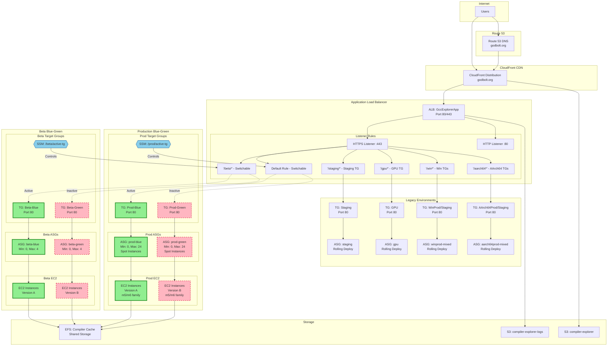
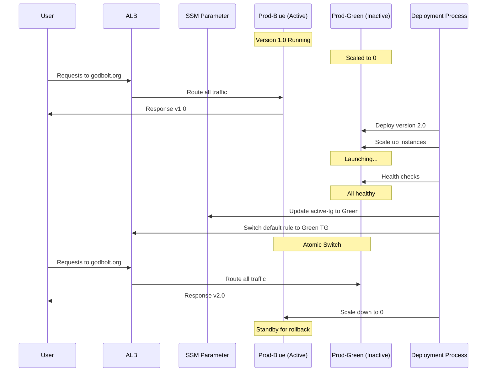
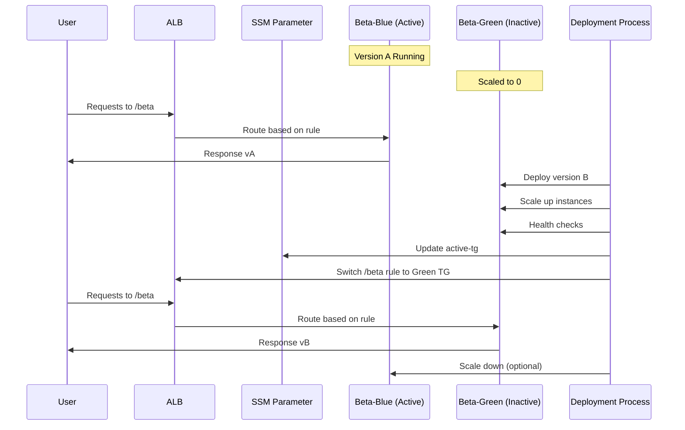

# Compiler Explorer AWS Architecture - Blue-Green Deployment

## Blue-Green Architecture Diagram (Proposed)



## Blue-Green Deployment Flow

### Production Environment



### Beta Environment



## Key Differences from Current Architecture

### Production (Hybrid Approach)
- **Two Target Groups**: Prod-Blue and Prod-Green
- **Two ASGs**: prod-blue and prod-green (only one active)
- **SSM Parameter**: Controls which TG receives traffic
- **ALB Default Rule**: Dynamically points to active TG
- **Deployment**: Scale up inactive, switch, scale down old

### Beta (Full Blue-Green)
- **Two Target Groups**: Beta-Blue and Beta-Green
- **Two ASGs**: beta-blue and beta-green
- **Path-based Rule**: `/beta*` switches between TGs
- **Testing Ground**: Validates blue-green before prod

### Other Environments (Unchanged)
- Staging, GPU, Windows, AArch64 keep rolling deployments
- Single target group and ASG per environment
- Instance refresh for updates

## Deployment States

### State 1: Normal Operation
```
Production:
  - Blue: Active (10 instances) → Serving traffic
  - Green: Inactive (0 instances) → Standby

Beta:
  - Blue: Active (1 instance) → Serving traffic
  - Green: Inactive (0 instances) → Standby
```

### State 2: During Deployment
```
Production:
  - Blue: Active (10 instances) → Still serving
  - Green: Warming up (10 instances) → Health checks

Beta:
  - Blue: Active (1 instance) → Still serving
  - Green: Warming up (1 instance) → Health checks
```

### State 3: Switch Moment
```
Production:
  - ALB Default Rule: Prod-Blue TG → Prod-Green TG
  - Traffic instantly moves to new version
  - No mixed versions!

Beta:
  - ALB /beta Rule: Beta-Blue TG → Beta-Green TG
  - Instant switch for beta traffic
```

### State 4: Post-Deployment
```
Production:
  - Blue: Inactive (10 instances) → Rollback ready
  - Green: Active (10 instances) → Serving traffic

Beta:
  - Blue: Inactive (0 instances) → Scaled down
  - Green: Active (1 instance) → Serving traffic
```

## Advantages Over Current System

1. **No Mixed Versions**: Traffic switches atomically between versions
2. **Instant Rollback**: Previous version stays warm (prod) or can be quickly restored
3. **Pre-deployment Validation**: New instances fully tested before receiving traffic
4. **Reduced Risk**: Bad deployments never receive production traffic
5. **Flexible Strategy**: Different approaches for different environments

## Implementation Priority

1. **Phase 1**: Beta environment (testing ground)
   - Validate blue-green mechanics
   - Test CLI tooling
   - Measure switch timing

2. **Phase 2**: Production environment
   - Implement hybrid approach
   - Keep old ASG warm for rollback
   - Monitor performance impact

3. **Phase 3**: Consider other environments
   - Evaluate if staging/gpu need blue-green
   - Keep simpler environments on rolling deploy
