# Compiler Explorer AWS Architecture - Blue-Green Deployment (Current Implementation)

## Blue-Green Architecture Diagram

```mermaid
graph TB
    subgraph "Internet"
        User[Users]
    end

    subgraph "CloudFront CDN"
        CF[CloudFront Distribution<br/>godbolt.org]
    end

    subgraph "Route 53"
        R53[Route 53 DNS<br/>godbolt.org]
    end

    subgraph "Application Load Balancer"
        ALB[ALB: GccExplorerApp<br/>Port 80/443]

        subgraph "Listener Rules"
            HTTPS[HTTPS Listener :443]
            HTTP[HTTP Listener :80]

            DefRule["Default Rule -> Switchable"]
            BetaRule["'/beta*' Rule -> Switchable"]
            StagingRule["'/staging*' -> Staging TG"]
            GPURule["'/gpu*' -> GPU TG"]
            WinRule["'/win*' -> Win TGs"]
            AArch64Rule["'/aarch64*' -> AArch64 TGs"]
        end
    end

    subgraph "Beta Blue-Green (Implemented)"
        subgraph "Beta Target Groups"
            TGBetaBlue[Target Group: Beta-Blue<br/>Port 80<br/>Health: /healthcheck]
            TGBetaGreen[Target Group: Beta-Green<br/>Port 80<br/>Health: /healthcheck]
        end

        subgraph "Beta ASGs"
            ASGBetaBlue[ASG: beta-blue<br/>Min: 0, Max: 4<br/>Launch Template: beta]
            ASGBetaGreen[ASG: beta-green<br/>Min: 0, Max: 4<br/>Launch Template: beta]
        end

        subgraph "Beta EC2 Instances"
            EC2BetaBlue[EC2 Instances<br/>Color: blue]
            EC2BetaGreen[EC2 Instances<br/>Color: green]
        end

        subgraph "State Management"
            SSMColor[SSM: /compiler-explorer/beta/active-color]
            SSMTargetGroup[SSM: /compiler-explorer/beta/active-target-group-arn]
        end
    end

    subgraph "Production Blue-Green (Implemented)"
        subgraph "Production Target Groups"
            TGProdBlue[Target Group: Prod-Blue<br/>Port 80<br/>Health: /healthcheck]
            TGProdGreen[Target Group: Prod-Green<br/>Port 80<br/>Health: /healthcheck]
        end

        subgraph "Production ASGs"
            ASGProdBlue[ASG: prod-blue<br/>Min: 0, Max: 40<br/>Launch Template: prod]
            ASGProdGreen[ASG: prod-green<br/>Min: 0, Max: 40<br/>Launch Template: prod]
        end

        subgraph "Production EC2 Instances"
            EC2ProdBlue[EC2 Instances<br/>Color: blue<br/>Mixed Instances]
            EC2ProdGreen[EC2 Instances<br/>Color: green<br/>Mixed Instances]
        end

        subgraph "Production State Management"
            SSMProdColor[SSM: /compiler-explorer/prod/active-color]
            SSMProdTargetGroup[SSM: /compiler-explorer/prod/active-target-group-arn]
        end
    end

    subgraph "Other Environments (Single ASG)"
        TGStaging[Target Group: Staging<br/>Port 80]
        TGGpu[Target Group: GPU<br/>Port 80]
        TGWin[Target Groups: Win*<br/>Port 80]
        TGAArch[Target Groups: AArch64*<br/>Port 80]

        ASGStaging[ASG: staging<br/>Rolling Deploy]
        ASGGpu[ASG: gpu<br/>Rolling Deploy]
        ASGWin[ASG: winprod-mixed<br/>Rolling Deploy]
        ASGAArch[ASG: aarch64prod-mixed<br/>Rolling Deploy]
    end

    subgraph "Terraform Modules"
        ModuleBetaBG[module beta_blue_green<br/>source = ./modules/blue_green]
        ModuleProdBG[module prod_blue_green<br/>source = ./modules/blue_green]
    end

    subgraph "Storage"
        EFS[EFS: Compiler Cache<br/>Shared Storage]
        S3Logs[S3: compiler-explorer-logs]
        S3Static[S3: compiler-explorer]
    end

    %% Connections
    User --> CF
    User --> R53
    R53 --> CF
    CF --> ALB

    ALB --> HTTPS
    ALB --> HTTP

    %% Production Blue-Green Flow (switchable)
    HTTPS --> DefRule
    HTTP --> DefRule
    DefRule -.->|Active| TGProdBlue
    DefRule -.->|Inactive| TGProdGreen
    SSMProdColor -->|Tracks Active| DefRule
    SSMProdTargetGroup -->|Current TG ARN| DefRule

    TGProdBlue --> ASGProdBlue
    TGProdGreen --> ASGProdGreen

    ASGProdBlue --> EC2ProdBlue
    ASGProdGreen --> EC2ProdGreen

    %% Beta Blue-Green Flow (switchable)
    HTTPS --> BetaRule
    BetaRule -.->|Active| TGBetaBlue
    BetaRule -.->|Inactive| TGBetaGreen
    SSMColor -->|Tracks Active| BetaRule
    SSMTargetGroup -->|Current TG ARN| BetaRule

    TGBetaBlue --> ASGBetaBlue
    TGBetaGreen --> ASGBetaGreen

    ASGBetaBlue --> EC2BetaBlue
    ASGBetaGreen --> EC2BetaGreen

    %% Other environments (unchanged)
    HTTPS --> StagingRule
    HTTPS --> GPURule
    HTTPS --> WinRule
    HTTPS --> AArch64Rule

    StagingRule --> TGStaging
    GPURule --> TGGpu
    WinRule --> TGWin
    AArch64Rule --> TGAArch

    TGStaging --> ASGStaging
    TGGpu --> ASGGpu
    TGWin --> ASGWin
    TGAArch --> ASGAArch

    %% Terraform Modules create blue-green resources
    ModuleBetaBG -.->|Creates| TGBetaBlue
    ModuleBetaBG -.->|Creates| TGBetaGreen
    ModuleBetaBG -.->|Creates| ASGBetaBlue
    ModuleBetaBG -.->|Creates| ASGBetaGreen
    ModuleBetaBG -.->|Creates| SSMColor
    ModuleBetaBG -.->|Creates| SSMTargetGroup

    ModuleProdBG -.->|Creates| TGProdBlue
    ModuleProdBG -.->|Creates| TGProdGreen
    ModuleProdBG -.->|Creates| ASGProdBlue
    ModuleProdBG -.->|Creates| ASGProdGreen
    ModuleProdBG -.->|Creates| SSMProdColor
    ModuleProdBG -.->|Creates| SSMProdTargetGroup

    %% Storage connections
    EC2BetaBlue --> EFS
    EC2BetaGreen --> EFS
    EC2ProdBlue --> EFS
    EC2ProdGreen --> EFS

    ALB --> S3Logs
    CF --> S3Static

    %% Styling
    classDef active fill:#90EE90,stroke:#228B22,stroke-width:3px,color:#000000
    classDef inactive fill:#FFB6C1,stroke:#DC143C,stroke-width:2px,stroke-dasharray: 5 5,color:#000000
    classDef switch fill:#87CEEB,stroke:#4682B4,stroke-width:2px,color:#000000
    classDef module fill:#DDA0DD,stroke:#8B008B,stroke-width:2px,color:#000000

    class TGBetaBlue,ASGBetaBlue,EC2BetaBlue active
    class TGBetaGreen,ASGBetaGreen,EC2BetaGreen inactive
    class TGProdBlue,ASGProdBlue,EC2ProdBlue active
    class TGProdGreen,ASGProdGreen,EC2ProdGreen inactive
    class SSMColor,SSMTargetGroup,SSMProdColor,SSMProdTargetGroup switch
    class ModuleBetaBG,ModuleProdBG module
```



## Current Implementation Details

### Terraform Module Structure

The blue-green implementation uses a reusable Terraform module:

```hcl
# terraform/beta-blue-green.tf
module "beta_blue_green" {
  source = "./modules/blue_green"

  environment               = "beta"
  vpc_id                    = module.ce_network.vpc.id
  launch_template_id        = aws_launch_template.CompilerExplorer-beta.id
  subnets                   = local.subnets
  asg_max_size              = 4
  initial_desired_capacity  = 0
  initial_active_color      = "blue"
}
```

### Module Components

The `./modules/blue_green` module creates:

1. **Two Target Groups**:
   ```hcl
   resource "aws_alb_target_group" "color" {
     for_each = toset(["blue", "green"])
     name     = "${title(var.environment)}-${title(each.value)}"
     # ... configuration
   }
   ```

2. **Two ASGs**:
   ```hcl
   resource "aws_autoscaling_group" "color" {
     for_each = toset(["blue", "green"])
     name     = "${var.environment}-${each.value}"
     # ... configuration
   }
   ```

3. **SSM Parameters**:
   ```hcl
   resource "aws_ssm_parameter" "active_color" {
     name  = "/compiler-explorer/${var.environment}/active-color"
     value = var.initial_active_color
   }

   resource "aws_ssm_parameter" "active_target_group" {
     name  = "/compiler-explorer/${var.environment}/active-target-group-arn"
     value = aws_alb_target_group.color[var.initial_active_color].arn
   }
   ```

### ALB Listener Rule Configuration

The beta listener rule was updated to reference the blue-green target groups:

```hcl
# terraform/alb.tf
resource "aws_alb_listener_rule" "compiler-explorer-alb-listen-https-beta" {
  lifecycle {
    # Ignore changes to the action since it's managed by blue-green deployment
    ignore_changes = [action]
  }

  priority = 1
  action {
    type = "forward"
    # This target group ARN is managed by blue-green deployment process
    target_group_arn = module.beta_blue_green.target_group_arns["blue"]
  }
  condition {
    path_pattern {
      values = ["/beta*"]
    }
  }
  listener_arn = aws_alb_listener.compiler-explorer-alb-listen-https.arn
}
```

## Deployment State Transitions

### State 1: Normal Operation (Blue Active)
```
Beta Status:
  Active Color: blue
  Inactive Color: green

ASG Status:
  blue (ACTIVE):
    Desired/Min/Max: 1/0/4
    Target Group: 1/1 healthy ✅
  green:
    Desired/Min/Max: 0/0/4
    Target Group: 0/0 healthy ❓

ALB Rule: /beta* -> Beta-Blue TG
```

### State 2: During Deployment
```
Step 0: Protecting blue ASG (MinSize=1, MaxSize=1)
Step 1: Scaling up green ASG to 1 instance
Step 2: Waiting for green instances to be healthy
Step 3: Verifying HTTP health checks
```

### State 3: Traffic Switch
```
Step 4: Switching /beta* rule -> Beta-Green TG
Step 5: Resetting green ASG MinSize to 0

Result:
  ALB Rule: /beta* -> Beta-Green TG (atomic switch)
  SSM: active-color = "green"
  SSM: active-target-group-arn = "Beta-Green ARN"
```

### State 4: Post-Deployment (Green Active)
```
Beta Status:
  Active Color: green
  Inactive Color: blue

ASG Status:
  blue:
    Desired/Min/Max: 1/0/4
    Target Group: 1/1 healthy 🟡 (standby)
  green (ACTIVE):
    Desired/Min/Max: 1/0/4
    Target Group: 1/1 healthy ✅
```

## Migration from Single ASG

The implementation replaced the old single beta ASG:

### Removed Components
- `aws_autoscaling_group.beta` resource
- "beta" entry from `ce-target-groups` variable
- Direct ASG attachment to single target group

### Added Components
- Blue-green Terraform module
- Dual target groups and ASGs
- SSM parameter state tracking
- Updated ALB listener rule reference

### No Impact Areas
- Other environments remain unchanged
- Existing monitoring and logging continue to work
- CloudFront integration continues to work seamlessly

## CLI Commands and State Management

### Command Overview
```bash
# Commands work for both beta and prod environments
ce --env {beta|prod} blue-green status     # Check current state
ce --env {beta|prod} blue-green deploy     # Deploy to inactive color
ce --env {beta|prod} blue-green switch     # Manual color switch
ce --env {beta|prod} blue-green rollback   # Revert to previous color
ce --env {beta|prod} blue-green cleanup    # Scale down inactive ASG
ce --env {beta|prod} blue-green shutdown   # Scale down active ASG
ce --env {beta|prod} blue-green validate   # Verify infrastructure
```

### State Tracking
The system tracks state via SSM parameters:
- `/compiler-explorer/{env}/active-color`: "blue" or "green"
- `/compiler-explorer/{env}/active-target-group-arn`: Current target group ARN

Where {env} is "beta" or "prod"

### Safety Features
- ASG capacity protection during deployment (MinSize/MaxSize locking)
- Existing instance detection and warnings
- Signal handling for graceful cleanup
- Confirmation prompts for destructive operations

## Future Architecture Considerations

### Production Implementation (Completed)
Production blue-green has been implemented with:
- `prod-blue-green.tf` using the same module with production-specific settings
- Default ALB listener actions updated to switch between blue/green target groups
- Mixed instances policy for cost optimization
- Auto-scaling enabled with CPU target of 50%

### Other Environments
The blue-green module can be reused for any environment:
```hcl
module "staging_blue_green" {
  source = "./modules/blue_green"
  environment = "staging"
  # ... other parameters
}
```

### Monitoring Enhancements
- CloudWatch dashboards for blue-green metrics
- Alerts for deployment failures
- Deployment duration tracking
- Target group health monitoring

This architecture provides a solid foundation for zero-downtime deployments while maintaining compatibility with existing infrastructure patterns.
