# Compiler Explorer AWS Architecture (Current State)

## High-Level Architecture Diagram

```mermaid
graph TB
    subgraph "Internet"
        User[Users]
    end

    subgraph "CloudFront CDN"
        CF[CloudFront Distribution<br/>godbolt.org]
    end

    subgraph "Route 53"
        R53[Route 53 DNS<br/>godbolt.org]
    end

    subgraph "Application Load Balancer"
        ALB[ALB: GccExplorerApp<br/>Port 80/443]

        subgraph "Listener Rules"
            HTTPS[HTTPS Listener :443]
            HTTP[HTTP Listener :80]

            DefRule["Default Rule - Prod TG"]
            BetaRule["'/beta*' - Beta TG"]
            StagingRule["'/staging*' - Staging TG"]
            GPURule["'/gpu*' - GPU TG"]
            WinRule["'/win*' - Win TGs"]
            AArch64Rule["'/aarch64*' - AArch64 TGs"]
            
            CompileRule["'/*/api/compiler/*/compile*' - CE Router TGs"]
            CMakeRule["'/*/api/compiler/*/cmake*' - CE Router TGs"]
        end
    end

    subgraph "Target Groups"
        TGProdBlue[TG: Prod-Blue<br/>Port 80]
        TGProdGreen[TG: Prod-Green<br/>Port 80]
        TGBetaBlue[TG: Beta-Blue<br/>Port 80]
        TGBetaGreen[TG: Beta-Green<br/>Port 80]
        TGStagingBlue[TG: Staging-Blue<br/>Port 80]
        TGStagingGreen[TG: Staging-Green<br/>Port 80]
        TGGpuBlue[TG: GPU-Blue<br/>Port 80]
        TGGpuGreen[TG: GPU-Green<br/>Port 80]
        TGWinBlue[TG: Win-Blue<br/>Port 80]
        TGWinGreen[TG: Win-Green<br/>Port 80]
        TGAArchBlue[TG: AArch64-Blue<br/>Port 80]
        TGAArchGreen[TG: AArch64-Green<br/>Port 80]
        TGConan[TG: Conan<br/>Port 1080]
        
        TGCERouterProd[TG: CE Router Prod<br/>Port 80]
        TGCERouterBeta[TG: CE Router Beta<br/>Port 80]  
        TGCERouterStaging[TG: CE Router Staging<br/>Port 80]
    end

    subgraph "Auto Scaling Groups"
        ASGProdBlue[ASG: prod-blue<br/>Min: 0, Max: 40<br/>Spot Instances]
        ASGProdGreen[ASG: prod-green<br/>Min: 0, Max: 40<br/>Spot Instances]
        ASGBetaBlue[ASG: beta-blue<br/>Min: 0, Max: 4]
        ASGBetaGreen[ASG: beta-green<br/>Min: 0, Max: 4]
        ASGStagingBlue[ASG: staging-blue<br/>Min: 0, Max: 4]
        ASGStagingGreen[ASG: staging-green<br/>Min: 0, Max: 4]
        ASGGpuBlue[ASG: gpu-blue<br/>Min: 0, Max: 8<br/>GPU Instances]
        ASGGpuGreen[ASG: gpu-green<br/>Min: 0, Max: 8<br/>GPU Instances]
        ASGWinBlue[ASG: win-blue<br/>Windows Instances]
        ASGWinGreen[ASG: win-green<br/>Windows Instances]
        ASGAArchBlue[ASG: aarch64-blue<br/>ARM Instances]
        ASGAArchGreen[ASG: aarch64-green<br/>ARM Instances]
        
        ASGCERouterProd[ASG: ce-router-prod<br/>Min: 1, Max: 20]
        ASGCERouterBeta[ASG: ce-router-beta<br/>Min: 1, Max: 10]
        ASGCERouterStaging[ASG: ce-router-staging<br/>Min: 1, Max: 10]
    end

    subgraph "EC2 Instances"
        EC2Prod[EC2 Instances<br/>m5/m6 family<br/>EBS Optimized]
        EC2Beta[EC2 Instances<br/>On-demand]
        EC2Staging[EC2 Instances<br/>On-demand]
        EC2Gpu[EC2 Instances<br/>g4dn.xlarge]
        EC2Win[EC2 Instances<br/>Windows]
        EC2AArch[EC2 Instances<br/>ARM/Graviton]
        ConanNode[Conan Node<br/>Static Instance]
        
        EC2CERouter[CE Router Instances<br/>Node.js + Nginx<br/>t4g/m7g instances]
    end

    subgraph "Storage & Messaging"
        EFS[EFS: Compiler Cache<br/>Shared Storage]
        S3Logs[S3: compiler-explorer-logs]
        S3Static[S3: compiler-explorer]
        
        DDBRouting[DynamoDB: CompilerRouting<br/>Environment-specific routing decisions]
        SQSProd[SQS: prod-compilation-queue.fifo<br/>Compilation requests]
        SQSBeta[SQS: beta-compilation-queue.fifo<br/>Compilation requests]
        SQSStaging[SQS: staging-compilation-queue.fifo<br/>Compilation requests]
        WSGateway[API Gateway: WebSocket<br/>events.godbolt.org<br/>Result delivery]
    end

    %% Connections
    User --> CF
    User --> R53
    R53 --> CF
    CF --> ALB

    ALB --> HTTPS
    ALB --> HTTP

    HTTPS --> DefRule
    HTTPS --> BetaRule
    HTTPS --> StagingRule
    HTTPS --> GPURule
    HTTPS --> WinRule
    HTTPS --> AArch64Rule
    HTTPS --> CompileRule
    HTTPS --> CMakeRule

    DefRule -.->|Switchable| TGProdBlue
    DefRule -.->|Switchable| TGProdGreen
    BetaRule -.->|Switchable| TGBetaBlue
    BetaRule -.->|Switchable| TGBetaGreen
    StagingRule -.->|Switchable| TGStagingBlue
    StagingRule -.->|Switchable| TGStagingGreen
    GPURule -.->|Switchable| TGGpuBlue
    GPURule -.->|Switchable| TGGpuGreen
    WinRule -.->|Switchable| TGWinBlue
    WinRule -.->|Switchable| TGWinGreen
    AArch64Rule -.->|Switchable| TGAArchBlue
    AArch64Rule -.->|Switchable| TGAArchGreen

    %% CE Router compilation endpoint routing
    CompileRule --> TGCERouterProd
    CompileRule --> TGCERouterBeta
    CompileRule --> TGCERouterStaging
    CMakeRule --> TGCERouterProd
    CMakeRule --> TGCERouterBeta
    CMakeRule --> TGCERouterStaging

    %% CE Router to ASG connections
    TGCERouterProd --> ASGCERouterProd
    TGCERouterBeta --> ASGCERouterBeta
    TGCERouterStaging --> ASGCERouterStaging
    
    %% CE Router instance connections
    ASGCERouterProd --> EC2CERouter
    ASGCERouterBeta --> EC2CERouter
    ASGCERouterStaging --> EC2CERouter

    TGProdBlue --> ASGProdBlue
    TGProdGreen --> ASGProdGreen
    TGBetaBlue --> ASGBetaBlue
    TGBetaGreen --> ASGBetaGreen
    TGStagingBlue --> ASGStagingBlue
    TGStagingGreen --> ASGStagingGreen
    TGGpuBlue --> ASGGpuBlue
    TGGpuGreen --> ASGGpuGreen
    TGWinBlue --> ASGWinBlue
    TGWinGreen --> ASGWinGreen
    TGAArchBlue --> ASGAArchBlue
    TGAArchGreen --> ASGAArchGreen
    TGConan --> ConanNode

    ASGProdBlue --> EC2Prod
    ASGProdGreen --> EC2Prod
    ASGBetaBlue --> EC2Beta
    ASGBetaGreen --> EC2Beta
    ASGStagingBlue --> EC2Staging
    ASGStagingGreen --> EC2Staging
    ASGGpuBlue --> EC2Gpu
    ASGGpuGreen --> EC2Gpu
    ASGWinBlue --> EC2Win
    ASGWinGreen --> EC2Win
    ASGAArchBlue --> EC2AArch
    ASGAArchGreen --> EC2AArch

    EC2Prod --> EFS
    EC2Beta --> EFS
    EC2Staging --> EFS
    EC2Gpu --> EFS

    %% CE Router workflow connections
    EC2CERouter --> DDBRouting
    EC2CERouter --> SQSProd
    EC2CERouter --> SQSBeta
    EC2CERouter --> SQSStaging
    EC2CERouter --> WSGateway
    
    %% Instances consume from SQS and respond via WebSocket
    EC2Prod --> SQSProd
    EC2Beta --> SQSBeta
    EC2Staging --> SQSStaging
    EC2Prod --> WSGateway
    EC2Beta --> WSGateway
    EC2Staging --> WSGateway

    ALB --> S3Logs
    CF --> S3Static
```

## Component Details

### CloudFront Distribution
- **Domain**: godbolt.org, compiler-explorer.com
- **Origin**: ALB (GccExplorerApp)
- **Behaviors**:
  - Static content cached
  - Dynamic content passed through
- **SSL**: ACM certificate for HTTPS

### Application Load Balancer (ALB)
- **Name**: GccExplorerApp
- **Type**: Internet-facing
- **Listeners**:
  - HTTP (80) → Redirect to HTTPS
  - HTTPS (443) → Route based on path
- **Health Checks**: `/healthcheck` endpoint
- **Deregistration Delay**: 20 seconds

### Path-Based Routing Rules
| Priority | Path Pattern | Target Group | Environment | Notes |
|----------|-------------|--------------|-------------|-------|
| **Compilation Endpoints** | | | | |
| 10       | `/api/compiler/*/compile*` | CE Router | All envs | **Smart routing via CE Router** |
| 11       | `/api/compiler/*/cmake*`   | CE Router | All envs | **Smart routing via CE Router** |
| 12       | `/beta/api/compiler/*/compile*` | CE Router Beta | Beta | **Beta-specific routing** |
| 13       | `/staging/api/compiler/*/compile*` | CE Router Staging | Staging | **Staging-specific routing** |
| **General Routing** | | | | |
| Default  | `/*`        | Prod         | Production  | Static content, UI |
| 1        | `/beta*`    | Beta         | Beta testing | UI, non-compilation APIs |
| 2        | `/staging*` | Staging      | Pre-prod testing | UI, non-compilation APIs |
| 3        | `/gpu*`     | GPU          | GPU compilers | Direct routing |
| 6        | `/wintest*` | WinTest      | Windows test | Direct routing |
| 7        | `/winstaging*` | WinStaging | Windows staging | Direct routing |
| 8        | `/winprod*` | WinProd      | Windows prod | Direct routing |

### CE Router Architecture (Compilation Endpoints)

The CE Router provides intelligent routing for compilation endpoints (`/api/compiler/*/compile` and `/api/compiler/*/cmake`) across all environments:

#### CE Router Components
- **CE Router ASGs**: Dedicated Auto Scaling Groups per environment (prod, beta, staging)
- **Instance Types**: t4g.medium, m7g.medium (ARM-based for efficiency)
- **Technology Stack**: Node.js application with Nginx reverse proxy
- **Scaling**: CPU-based auto-scaling (1-20 instances for prod, 1-10 for beta/staging)

#### Hybrid Routing Strategy
1. **Queue-Based Routing** (prod, staging, beta):
   - CE Router → DynamoDB lookup → SQS queue → WebSocket response
   - Uses environment-specific FIFO queues for reliable message delivery
   - Instances consume from queues and respond via WebSocket

2. **Direct URL Forwarding** (winprod, gpu, etc.):
   - CE Router → DynamoDB lookup → Direct HTTP forward to environment URL
   - No queues/WebSocket needed for specialized environments

#### Message Flow
1. **ALB** routes `/api/compiler/*/compile` to appropriate CE Router target group
2. **CE Router** looks up compiler routing in DynamoDB CompilerRouting table
3. **Queue Route**: Send to SQS → Subscribe to WebSocket → Return result
4. **URL Route**: Forward directly to environment URL → Return response

### Auto Scaling Groups

#### Production ASGs (Blue-Green)
- **Blue ASG**: prod-blue (active or standby)
- **Green ASG**: prod-green (active or standby)
- **Instance Types**: m5.large, m6.large, etc. (mixed instances policy)
- **Purchase Options**: 100% Spot instances
- **Scaling**: CPU target tracking (50%) on active ASG
- **Health Check**: ELB type, 240s grace period
- **Target Groups**: Prod-Blue and Prod-Green (ALB switches between them)
- **State Management**: SSM parameters track active color

#### All Environment ASGs (Blue-Green Enabled)
- **Beta**: beta-blue/green ASGs with blue-green deployment
- **Staging**: staging-blue/green ASGs with blue-green deployment
- **GPU**: gpu-blue/green ASGs with g4dn.xlarge instances for CUDA compilers
- **Windows**: win-blue/green ASGs with Windows Server instances
- **AArch64**: aarch64-blue/green ASGs with ARM/Graviton2 instances

### Target Group Health Checks
- **Protocol**: HTTP
- **Path**: `/healthcheck`
- **Interval**: 10 seconds
- **Timeout**: 8 seconds
- **Healthy Threshold**: 2 checks
- **Unhealthy Threshold**: 3 checks

### Storage Architecture
- **EFS**: Shared filesystem for compiler cache
  - Mounted on all Linux instances
  - Burst mode for performance
- **S3 Buckets**:
  - `compiler-explorer`: Static content
  - `compiler-explorer-logs`: ALB access logs
  - `ce-cdn-net`: CDN content

## Request Flow

### General Content Flow
1. **User Request** → godbolt.org
2. **Route 53** → Resolves to CloudFront  
3. **CloudFront** → Checks cache, forwards to ALB if needed
4. **ALB** → Routes based on path:
   - `/beta*` → Beta target group (UI, non-compilation)
   - `/staging*` → Staging target group (UI, non-compilation)
   - Default → Production target group (UI, non-compilation)
5. **Target Group** → Selects healthy instance
6. **EC2 Instance** → Processes request
7. **Response** → Returns through ALB → CloudFront → User

### Compilation Request Flow (via CE Router)
1. **User Request** → `/api/compiler/gcc/compile`
2. **Route 53** → Resolves to CloudFront
3. **CloudFront** → Forwards to ALB (compilation not cached)
4. **ALB** → Routes to CE Router target group (based on path pattern)
5. **CE Router** → 
   - Looks up compiler routing in DynamoDB
   - **Queue Route**: Publishes to SQS → Subscribes to WebSocket → Waits for result
   - **URL Route**: Forwards directly to environment URL
6. **Backend Instances** → 
   - **Queue Route**: Poll SQS → Compile → Publish result to WebSocket
   - **URL Route**: Process compilation directly
7. **CE Router** → Receives result (via WebSocket or direct response)
8. **Response** → Returns through ALB → CloudFront → User

## High Availability Features

- **Multi-AZ Deployment**: Instances spread across availability zones
- **Auto Scaling**: Automatic capacity adjustment based on load
- **Health Checks**: Automatic instance replacement on failure
- **Spot Instance Diversification**: Multiple instance types for availability
- **CloudFront Caching**: Reduces origin load
- **Connection Draining**: 20-second graceful shutdown

## Current Implementation Status

1. **Blue-Green Deployment**: All major environments now support blue-green deployment for zero-downtime deployments
2. **CE Router**: Smart compilation routing implemented for prod, beta, and staging environments with queue-based and URL-based routing strategies
3. **Environments Supported**: prod, beta, staging, gpu, wintest, winstaging, winprod, aarch64staging, aarch64prod
4. **Legacy Compatibility**: Monitoring and tooling have been updated to work with blue-green ASG names
5. **Resource Overhead**: Blue-green requires brief 2x capacity during deployments across all environments
6. **Compilation Architecture**: CE Router provides better scalability, reliability, and workload distribution for compilation requests
