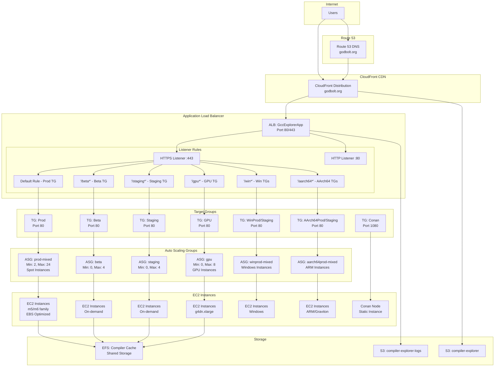

# Compiler Explorer AWS Architecture (Current State)

## High-Level Architecture Diagram

## Component Details

### CloudFront Distribution
- **Domain**: godbolt.org, compiler-explorer.com
- **Origin**: ALB (GccExplorerApp)
- **Behaviors**:
  - Static content cached
  - Dynamic content passed through
- **SSL**: ACM certificate for HTTPS

### Application Load Balancer (ALB)
- **Name**: GccExplorerApp
- **Type**: Internet-facing
- **Listeners**:
  - HTTP (80) → Redirect to HTTPS
  - HTTPS (443) → Route based on path
- **Health Checks**: `/healthcheck` endpoint
- **Deregistration Delay**: 20 seconds

### Path-Based Routing Rules
| Priority | Path Pattern | Target Group | Environment |
|----------|-------------|--------------|-------------|
| Default  | `/*`        | Prod         | Production  |
| 1        | `/beta*`    | Beta         | Beta testing |
| 2        | `/staging*` | Staging      | Pre-prod testing |
| 3        | `/gpu*`     | GPU          | GPU compilers |
| 6        | `/wintest*` | WinTest      | Windows test |
| 7        | `/winstaging*` | WinStaging | Windows staging |
| 8        | `/winprod*` | WinProd      | Windows prod |

### Auto Scaling Groups

#### Production ASG (prod-mixed)
- **Instance Types**: m5.large, m6.large, etc. (mixed)
- **Purchase Options**: 100% Spot instances
- **Scaling**: CPU target tracking (50%)
- **Health Check**: ELB type, 240s grace period

#### Specialized ASGs
- **GPU**: g4dn.xlarge instances for CUDA compilers
- **Windows**: Windows Server instances
- **AArch64**: ARM/Graviton2 instances

### Target Group Health Checks
- **Protocol**: HTTP
- **Path**: `/healthcheck`
- **Interval**: 10 seconds
- **Timeout**: 8 seconds
- **Healthy Threshold**: 2 checks
- **Unhealthy Threshold**: 3 checks

### Storage Architecture
- **EFS**: Shared filesystem for compiler cache
  - Mounted on all Linux instances
  - Burst mode for performance
- **S3 Buckets**:
  - `compiler-explorer`: Static content
  - `compiler-explorer-logs`: ALB access logs
  - `ce-cdn-net`: CDN content

## Request Flow

1. **User Request** → godbolt.org
2. **Route 53** → Resolves to CloudFront
3. **CloudFront** → Checks cache, forwards to ALB if needed
4. **ALB** → Routes based on path:
   - `/beta*` → Beta target group
   - `/staging*` → Staging target group
   - Default → Production target group
5. **Target Group** → Selects healthy instance
6. **EC2 Instance** → Processes compilation request
7. **Response** → Returns through ALB → CloudFront → User

## High Availability Features

- **Multi-AZ Deployment**: Instances spread across availability zones
- **Auto Scaling**: Automatic capacity adjustment based on load
- **Health Checks**: Automatic instance replacement on failure
- **Spot Instance Diversification**: Multiple instance types for availability
- **CloudFront Caching**: Reduces origin load
- **Connection Draining**: 20-second graceful shutdown

## Current Limitations

1. **Rolling Deployments**: Instance refresh causes mixed versions
2. **No Instant Rollback**: Must wait for full refresh to revert
3. **Shared Target Groups**: Can't pre-stage new versions
4. **Single Color Model**: No blue-green capability (except upcoming beta test)
