# CE Router Request Path — Failure Atlas

Every branch a compilation request can take from the browser to the answer, and what
each failure looks like from the three places you can observe it: the user, the router
log, and the worker log.

Companion to `lambda_compilation_workflow.md`, which describes the happy path, and to
`ce-router-cutover-checklist.md`, which is what to actually run. This document is about
everything else that can happen.

Derived from reading, at the time of writing:

- `compiler-explorer` — `lib/compilation/sqs-compilation-queue.ts`, `lib/execution/events-websocket.ts`, `lib/base-compiler.ts`, `lib/handlers/compile.ts`
- `ce-router` (branch `build-system-routes`) — `src/compiler-explorer-router.ts`, `src/services/{result-waiter,routing,websocket-manager,http-forwarder}.ts`, `src/utils/index.ts`
- `infra` — `events-lambda/events-{sendmessage,connections}.js`, `terraform/{cloudfront,alb,apigateway_events_api,ce-router}.tf`, `terraform/modules/{blue_green,ce_router}/main.tf`, `nginx/ce-router.conf`, `init/start.sh`, `bin/lib/{blue_green_deploy,deployment_utils}.py`

Findings are marked by confidence:

- **[read]** — read directly from the code, high confidence
- **[infer]** — follows from the code but not observed running
- **[verify]** — depends on an AWS platform limit or live config; check before relying on it

---

## 1. The path, end to end

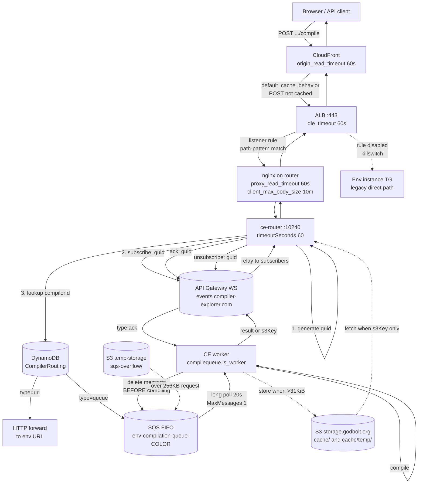

Two things about this picture matter more than the rest:

1. **The result does not come back the way it went out.** The request travels by SQS;
   the answer travels by WebSocket through a completely different AWS service. Either
   leg can fail independently, and the failures look nothing alike.
2. **The SQS message is deleted before the compile starts**
   (`sqs-compilation-queue.ts` — the `finally` block in `pop()`). There is no SQS
   redelivery for anything that goes wrong after pickup. **[read]**

---

## 2. The timeout stack

Four independent layers, all currently set to exactly 60 seconds:

| Layer | Setting | Source |
|---|---|---|
| CloudFront | `origin_read_timeout = 60` | `terraform/cloudfront.tf:62` (and `:193`, `:322`) |
| ALB | `idle_timeout = 60` | `terraform/alb.tf:2`, `:20` |
| nginx | `proxy_read_timeout 60s` | `nginx/ce-router.conf` |
| ce-router (queue path) | `timeoutSeconds = 60` | `src/compiler-explorer-router.ts:32` |
| ce-router (URL path) | axios `timeout: 60000` | `src/services/http-forwarder.ts` |

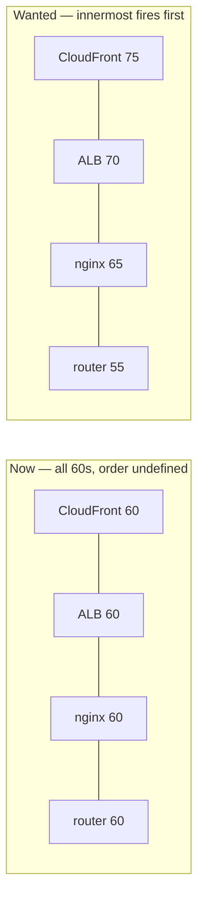

A compile that runs near 60s produces a **race with no defined winner**. The router
wants to answer `408 Compilation timeout` with a JSON body; whichever outer layer fires
first instead returns its own `504` with an HTML body. The same underlying event is
reported to the user in at least four different ways depending on scheduling jitter.
**[read]**

Fix is ordering, not magnitude: each layer strictly longer than the one inside it, so
the router's own error is always the one the user sees.

The URL-forwarding path shows what equal deadlines cost: its axios timeout is also 60s, so
`Request timeout to ${targetUrl}` — the one error that would name the failing target — can
never fire before an outer layer returns an HTML 504 instead. **[measured]**

---

## 3. Stage-by-stage branches

### S1 — Client → CloudFront

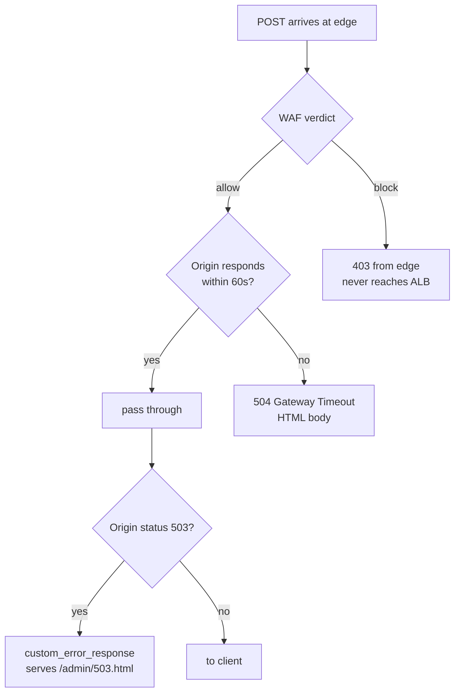

| ID | Branch | Notes |
|---|---|---|
| S1.1 | WAF allows | Bot Control is currently in **count** mode (`a7ea97221`). If it is ever flipped to block, API clients are the first casualty. **[verify]** |
| S1.2 | Origin timeout | 60s, see §2. **[read]** |
| S1.3 | 503 error page | `error_caching_min_ttl = 5` with `response_page_path = /admin/503.html` (`cloudfront.tf:171-176`). POST responses are not cached, so this most likely affects GETs only — but it does mean an ALB-level 503 reaches the user as an HTML page, not a JSON error. **[verify]** |

### S2 — CloudFront → ALB → router

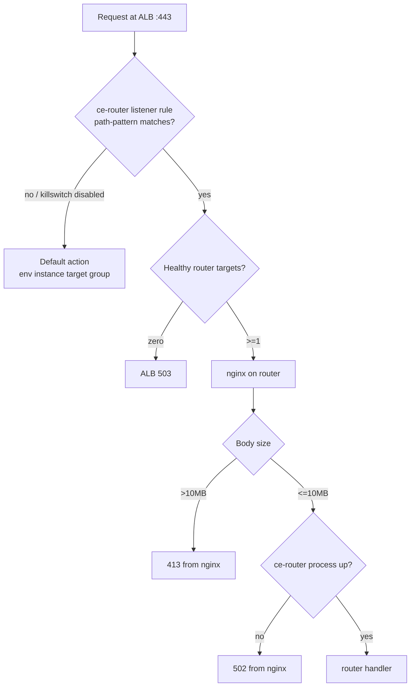

| ID | Branch | Notes |
|---|---|---|
| S2.1 | Rule matches | Patterns are `/{env}/api/compiler/*/compile`, `*/cmake`, `*/build/*` (`bin/lib/cli/ce_router.py`, `compilation_path_patterns`). Path-only — **method is not matched**, so a `GET` on those paths reaches the router and gets an Express 404. **[read]** |
| S2.2 | Killswitch off | `ce ce-router disable -e <env>` rewrites the rule to `/killswitch-disabled-<env>-*`, which never matches. Fallback is immediate. **[read]** |
| S2.3 | No healthy targets | beta and staging routers run `desired_capacity = 1` (`terraform/ce-router.tf`), so one unhealthy instance is a total compile outage for that env. **[read]** |
| S2.4 | Body limit mismatch | nginx `client_max_body_size 10m` vs. Express `limit: '16mb'`. Requests between 10MB and 16MB are rejected by nginx before the router sees them. **[read]** |
| S2.5 | Upstream keepalive | nginx sets `Connection: 'upgrade'` unconditionally, including for ordinary POSTs where `$http_upgrade` is empty. This is the classic misconfiguration that breaks upstream keepalive and produces sporadic 502s. Wants a `map $http_upgrade $connection_upgrade`. **[infer]** |

### S3 — Router: parse, guid, subscribe

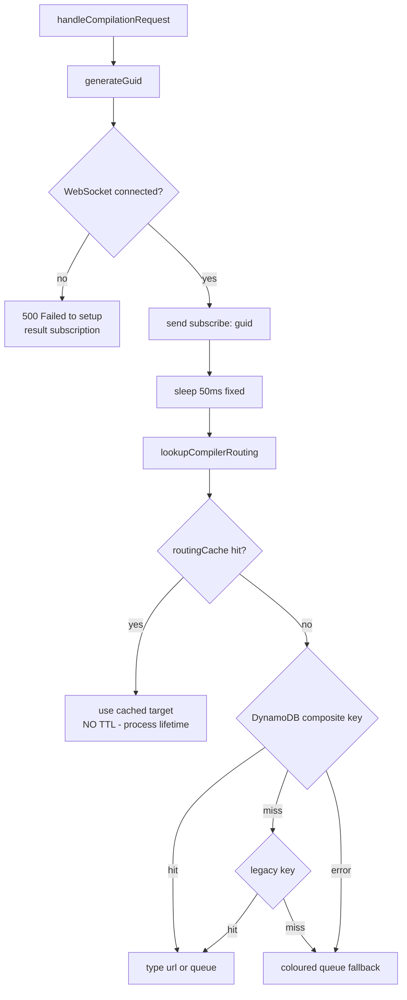

| ID | Branch | Notes |
|---|---|---|
| S3.1 | Subscribe before routing | The router subscribes **before** it knows whether the compiler is queue- or URL-routed, so every URL-routed compile costs a wasted subscribe + unsubscribe round trip (two Lambda invocations, one DynamoDB write, one delete). **[read]** |
| S3.2 | WS down at subscribe | `send()` rejects → `500`. Every compile fails instantly while the socket is down. **[read]** |
| S3.3 | **The 50ms sleep** | `src/compiler-explorer-router.ts:228`. This is the entire defence against the subscribe/result race. See S9.2. **[read]** |
| S3.4 | **`routingCache` has no expiry** | `src/services/routing.ts` — entries are only ever removed by `clearRoutingCaches()`. They hold the routing *decision*, not a resolved URL, so the colour is applied per request and recovers on its own; a stale **routing-table** decision does not. See §5.1. **[read]** |

### S4 — URL-routed branch

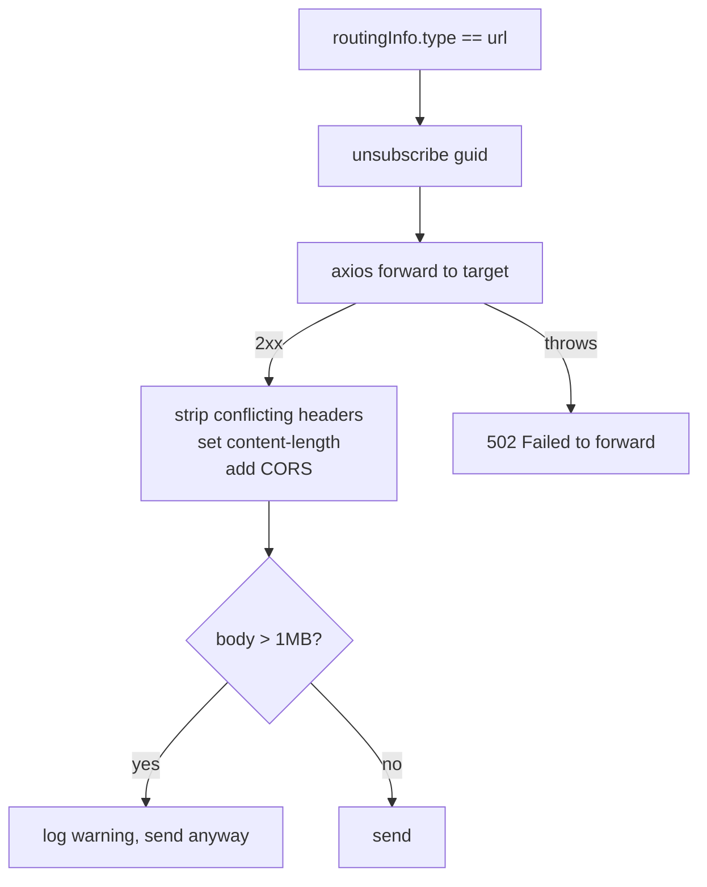

| ID | Branch | Notes |
|---|---|---|
| S4.1 | **Caller's `content-length` is forwarded** | `prepareForwardHeaders` strips hop-by-hop headers but passes `content-length` through, while the body has been parsed by Express and re-serialised with `JSON.stringify`. The two lengths agree only if the caller serialised byte-identically. When ours is shorter the target blocks on bytes that never arrive, and the caller gets an HTML 504 at the 60s mark. Measured on beta: the same semantic body at 155 bytes (`json.dumps` defaults) times out, at 141 bytes (compact) returns in 0.62s. Reaches **every** URL-routed compiler — Windows, GPU, aarch64 — for any client that does not serialise like `JSON.stringify`; the CE frontend does, which is why it went unnoticed. Fixed in ce-router `0.3.0`. **Not live until instances are refreshed** — routers install `releases/latest` at boot, so a running instance keeps whatever it started with. **[measured]** |
| S4.2 | Forward timeout equals the outer deadlines | See §2. **[read]** |

Otherwise self-contained: no WebSocket, no SQS, no ack. If queue-routed compiles are broken
and URL-routed ones are fine, everything in §4 below is ruled out at once — a useful first
bisect during an incident.

### S5 — Queue-routed branch: SQS send

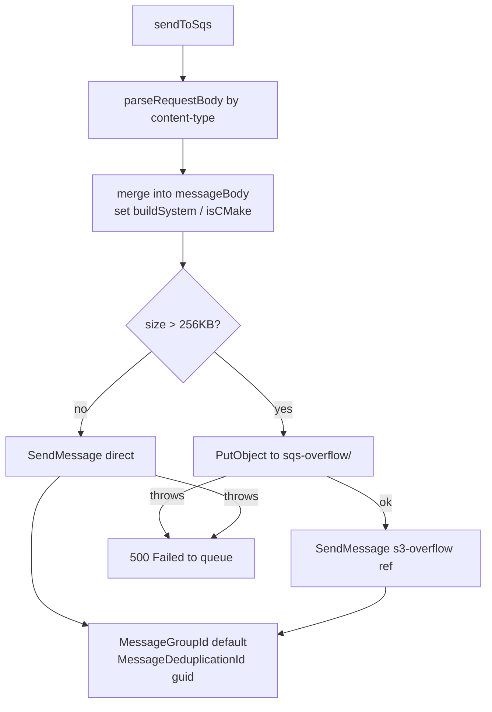

| ID | Branch | Notes |
|---|---|---|
| S5.1 | Content-type dispatch | `parseRequestBody` treats anything without `application/json` as `{source: body}`, which is right for the documented `text/plain` form — source as the body, options in the query string — and that works through the router (measured). Form-encoded bodies never arrive here: the no-JS UI at `/noscript` posts to `/api/noscript/compile`, which has its own `express.urlencoded` route and **does not match any ce-router ALB rule** (`/{env}/api/compiler/*/…`). It bypasses the router, and prod and beta return byte-identical results. **[measured]** |
| S5.2 | Constant message group | `MessageGroupId: 'default'` for every message. FIFO allows one in-flight message per group, so receives serialise across the entire environment. Survivable because the worker deletes on pickup, not after compiling — but it is a hard throughput ceiling worth measuring before prod. **[infer]** |
| S5.3 | Dedup by guid | Fresh uuid per request, so dedup never triggers. Fine. **[read]** |

### S6 — Worker pickup

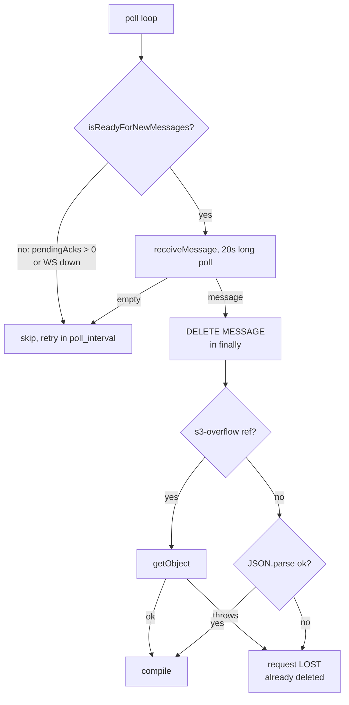

| ID | Branch | Notes |
|---|---|---|
| S6.1 | **Ack gate on pickup** | `isReadyForNewMessages()` (`events-websocket.ts:114`) requires `pendingAcks.size === 0`. Both worker threads share **one** `PersistentEventsSender`, so a single unacked result idles the whole instance. **[read]** |
| S6.2 | **Delete-before-compile** | The `finally` deletes the message as soon as it is parsed. Any failure after that point — S3 fetch, parse, compiler crash, process death — loses the request outright. No redelivery. The user waits the full 60s. **[read]** |
| S6.3 | Retention vs. timeout | Queue retention is 60s (`modules/blue_green/main.tf`), matching the router's deadline, so a message that can no longer be answered is dropped rather than compiled for nobody. A message picked up just under the deadline still produces a late result. See §5.2. **[read]** |

### S7 — Compile

> **What `headers` means in this document.** The `headers` field on the SQS message is
> the end user's inbound **HTTP request headers**, copied verbatim by the router
> (`compiler-explorer-router.ts:217`, `const headers = req.headers`) into the message
> body as an ordinary JSON property. They are not SQS message attributes, and by the
> time the worker sees them they are just data. The worker reads exactly **one key from
> them, once** — `msg.headers['content-type']` at `sqs-compilation-queue.ts:355` — to
> re-derive a boolean the router already knew.
>
> Two consequences: (1) unlike the URL-routing path, which strips hop-by-hop headers via
> `prepareForwardHeaders` (`ce-router/src/services/http-forwarder.ts:58`), the queue path
> copies the header set wholesale, so `cookie`, `x-forwarded-for` and `user-agent` travel
> into the SQS body and, for >256KB requests, into an S3 object under
> `temp-storage.godbolt.org/sqs-overflow/`. Internal systems, so hygiene rather than an
> incident — but the worker needs one header and could be sent one. (2) a repeated header
> arrives as `string[]`, which is why `RemoteCompilationRequest.headers` is typed
> `Record<string, string | string[]>` and `isJsonContentType` takes the first value.

| ID | Branch | Notes |
|---|---|---|
| S7.1 | Unknown build system | `getRequestedBuildSystem` throws, caught, returned as a normal failed compilation naming the build system. Correct behaviour. **[read]** |
| S7.2 | Compiler not found | Throws → error result with `code: -1`. **[read]** |
| S7.3 | Request format | The format is decided from the recorded content-type by `isJsonContentType()`, which parses it the way `req.is('json')` does — parameters stripped, trimmed, lower-cased, first value if the header arrived repeated ([#9148](https://github.com/compiler-explorer/compiler-explorer/pull/9148)). A request compiles the same way whichever path it arrived by, so a caller appending `; charset=utf-8` is handled. **[read]** |

### S8 — Result sizing and `s3Key`

This is the subtlest stage. Two independent size decisions are made in two different
files against two different values.

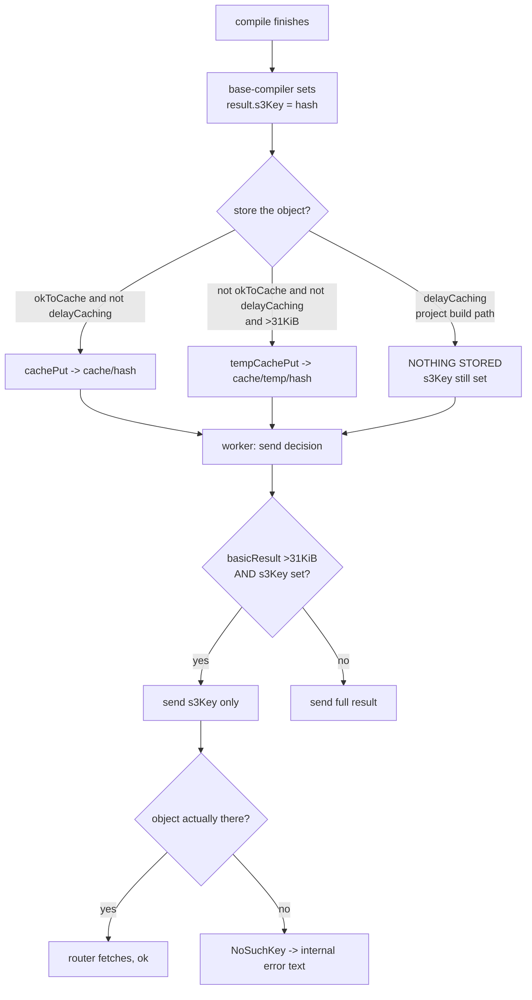

| ID | Branch | Notes |
|---|---|---|
| S8.1 | Two different measurements | `base-compiler.ts:3671-3684` measures `result` **before** `execTime`/`queueTime` are added; `sqs-compilation-queue.ts:305-318` measures `basicResult` **after**. A result sitting within a few hundred bytes of 31KiB can be judged "small, don't store" by one and "large, send by reference" by the other. **[read]** |
| S8.2 | `delayCaching` gap | The project-build path calls `afterCompilation(..., delayCaching = true)` (`base-compiler.ts:3718`), which skips **both** the cachePut and the temp store while still assigning `s3Key`. **[read]** |
| S8.3 | Failure is cosmetic-looking | The router's fallback returns a well-formed compilation result whose stderr reads `An internal error has occurred while retrieving the compilation result`. It looks like a compiler problem, not an infrastructure one. This is the shape of issue #9015; there is an untracked repro at `ce-router/test/unit/issue-9015-e2e.test.ts`. **[read]** |
| S8.4 | Oversized inline result | If a >128KB result is ever sent whole (because `s3Key` was unset), it exceeds the API Gateway WebSocket message limit. Worth confirming what the platform does with it — reject, or drop the connection. **[verify]** |

### S9 — Events Lambda relay

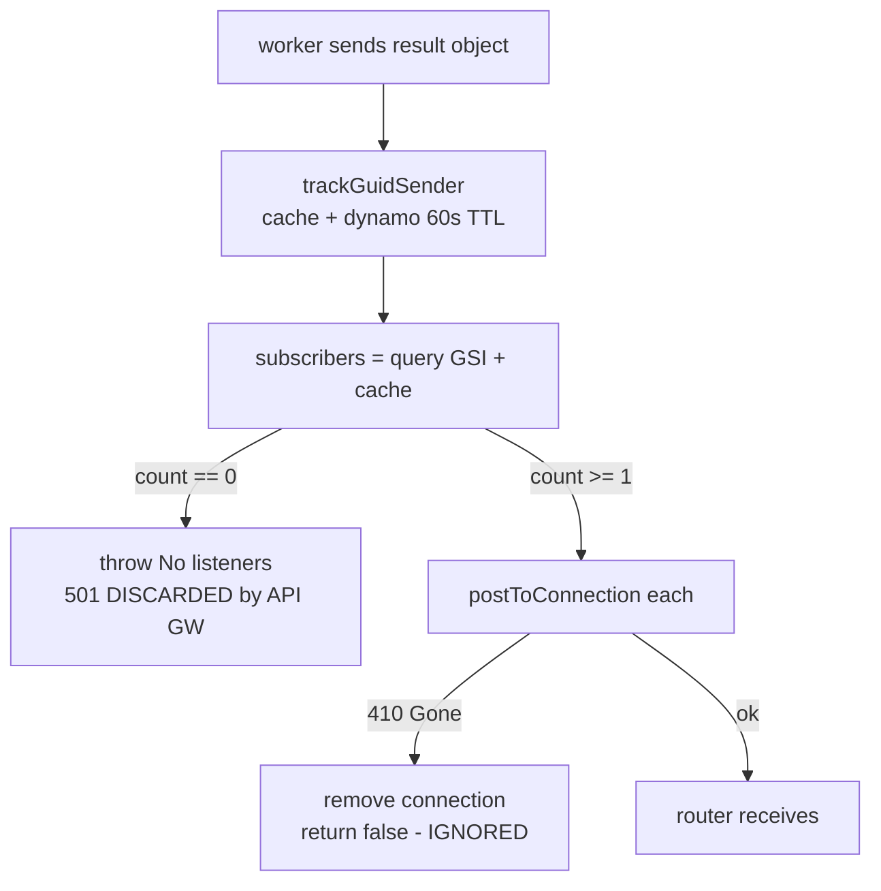

| ID | Branch | Notes |
|---|---|---|
| S9.1 | **The 501 goes nowhere** | `terraform/apigateway_events_api.tf` declares no `aws_apigatewayv2_route_response` for any route, so the API is one-way and the handler's `{statusCode: 501}` is discarded. From the worker's side, "nobody was listening" and "my ack got lost" are the **same event** — which is why it burns the full retry budget on both. **[read]** |
| S9.2 | Subscribe race | `subscribers()` merges a per-container in-memory cache with a GSI query. The router subscribes before it queues the work, but that orders only its own calls: `subscribe()` resolves when the frame is written to the router's socket, and the result arrives on the **worker's** connection, so the two Lambda invocations have no ordering relationship. What actually protects the subscribe is a head start — the 50ms sleep, the routing lookup, `SendMessage`, worker pickup and the compile itself, so 150-250ms at the very least. Losing it needs the subscribe invocation to stall longer than that, which in practice means a cold start. **Self-correcting**: `relay_request` throws, the worker gets no ack, and its retry 3s later re-runs `subscribers()` — by then the subscribe has landed. Costs a ~3s delay and two wasted retries, not a timeout. **[infer]** |
| S9.4 | **Subscribe silently lost** | If the subscribe's `PutItem` throws, `update()` removes the cache entry it optimistically added and rethrows; the handler returns `{statusCode: 501}`, which the one-way API discards (S9.1). The router already resolved `subscribe()` and queued the compile, so it never learns the subscription does not exist — and unlike S9.2 no retry can fix it. This is the path that produces a real 60s timeout. See §5.3 for why it is load-dependent rather than rare. **[read]** |
| S9.3 | **410 return value ignored** | `relay_request` does `await send_message(...)` and discards the boolean. A dead subscriber is indistinguishable from a delivered one. The connection is removed as a side effect, so the worker's *next* retry finds zero subscribers and takes the S9.1 path. **[read]** |

### S10 — Router receives result

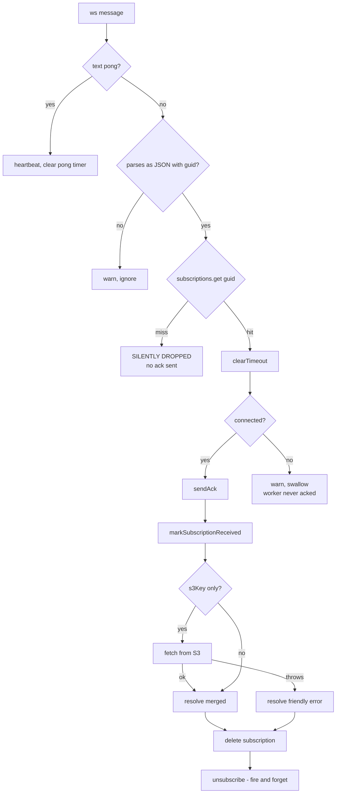

| ID | Branch | Notes |
|---|---|---|
| S10.1 | **Ack only inside the hit branch** | `src/services/result-waiter.ts:31` wraps `sendAck` in `if (subscription)`. Once a result has been delivered or timed out, any retransmission of that guid arrives, matches nothing, and is dropped **without an ack** — so the worker's retry is wasted even though it was delivered. **[read]** |
| S10.2 | S3 failure resolves, not rejects | The friendly error is `resolve`d, so the request returns `200` with an error inside the body rather than a 5xx. Invisible to ALB metrics. **[read]** |
| S10.3 | Unsubscribe is best-effort | Only attempted `if (this.wsManager.isConnected())`, failures logged and swallowed. Subscription rows are written with **no TTL** (`events-connections.js:106`), so every dropped unsubscribe leaks a row permanently. **[read]** |

### S11 — Ack round trip

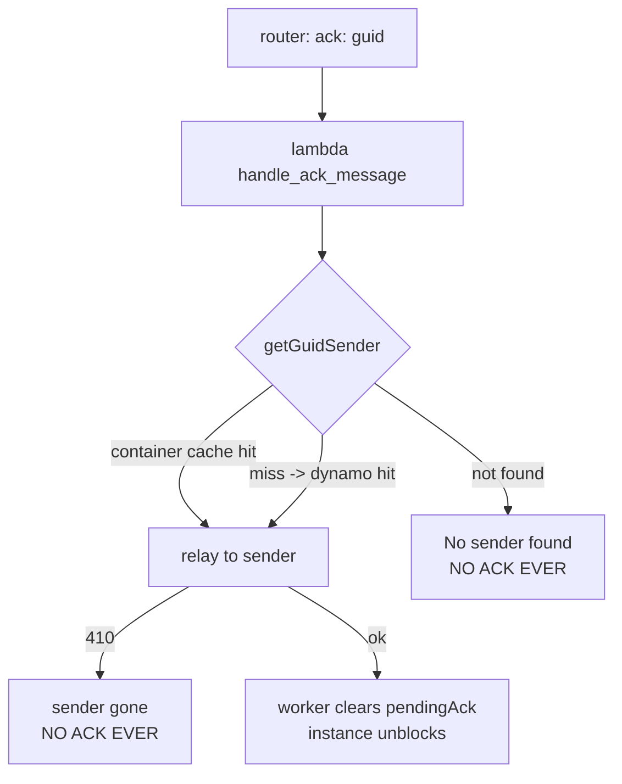

| ID | Branch | Notes |
|---|---|---|
| S11.1 | 60s TTL on the mapping | `trackGuidSender` writes with a 1-minute TTL. Acks normally arrive in milliseconds, so this is usually fine — but note DynamoDB TTL deletion is lazy, so the row may outlive its TTL or (on a cold container) be missing from cache entirely. **[read]** |
| S11.2 | Both failure paths are silent to the worker | Same as S9.1: the worker cannot tell "no sender found" from "ack lost in transit". **[read]** |

### S12 — Worker ack handling

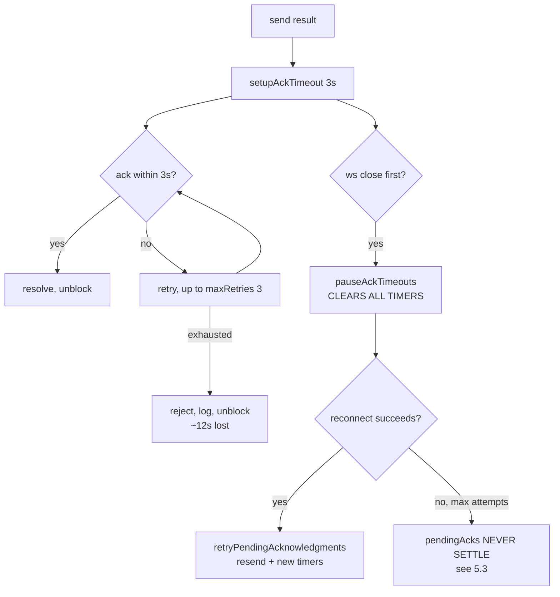

---

## 4. Scenario matrix

`Heals?` means: does the system return to normal on its own, without an operator?

| ID | Trigger | User sees | Worker state | Heals? | Signal to look for |
|---|---|---|---|---|---|
| F-01 | Router WS down at subscribe | `500` instantly | unaffected | yes, on reconnect | router: `Failed to setup result subscription` |
| F-02 | Router WS flapping | intermittent `500` | unaffected | **no** — `reconnectAttempts` resets to 0 on every open, so it never exhausts and the healthcheck stays `200` | router: repeated `Persistent WebSocket connection established` |
| F-03 | Router WS max attempts exhausted | `503` from ALB | unaffected | yes — healthcheck 503 → ASG replaces | router: `Max websocket reconnection attempts` |
| F-04 | Subscribe loses the race to the result | **~3s slower than usual**, then correct | one wasted retry | yes — the retry re-runs the lookup | lambda: `No listeners for <guid>` followed by a successful relay |
| F-04b | **Subscribe `PutItem` throttled or failed** | hangs 60s → `408`/`504` | 12s stall | **no** — no retry can help, the subscription does not exist | lambda: `Failed to subscribe <conn> to <guid>`; DynamoDB `ThrottledRequests` on `events-connections` |
| F-05 | Compiler missing from routing table | normal (falls back to coloured queue) | normal | n/a | router: `No routing found for compiler` |
| F-06 | DynamoDB routing lookup fails | normal (falls back) | normal | yes | router: `Failed to lookup routing` |
| F-07 | **Stale routing decision after a deploy** | version skew — served by the previous deployment's code; real timeouts only after `cleanup_inactive` scales the old ASG to 0 (§5.1) | normal — it is talking to the old colour's workers | **no** for a routing-table change; a stale *colour* now clears itself within 30s | old colour queue still active after a deploy; same compiler succeeding on one router and not another |
| F-08 | Worker started without `--instance-color` | hangs 60s → `408`, every queue-routed request | idle, polling wrong queue | **no** | worker startup: `No instance color detected` |
| F-09 | SQS send fails | `500` | unaffected | yes | router: `Failed to send message to SQS` |
| F-10 | S3 overflow PUT fails | `500` | unaffected | yes | router: `Failed to send message to SQS` |
| F-11 | S3 overflow GET fails on worker | hangs 60s → `408` | message already deleted, request lost | per-request | worker: `Failed to fetch overflow message from S3` |
| F-12 | Malformed message body | hangs 60s → `408` | message already deleted, request lost | per-request | worker: `JSON.parse failed` |
| F-13 | Unknown build system | clean compile error naming it | normal | n/a | worker: `Unknown build system` |
| F-18 | Result >31KiB, object stored | normal | normal | n/a | router: `Fetching large compilation result from S3` |
| F-19 | Result >31KiB, **object missing** | `200` with `An internal error has occurred…` in stderr | normal | **no** | router: `Failed to fetch S3 compilation result` |
| F-20 | Project build near the 31KiB boundary | as F-19 | normal | **no** | as F-19 |
| F-21 | Ack lost (no sender found) | normal — user already got the result | **12s stall** | yes, after 12s | lambda: `No sender found for GUID` |
| F-22 | Ack lost (sender 410) | normal | 12s stall | yes | lambda: `Failed to send ack … disconnected` |
| F-23 | Result delivered, router 410 | hangs 60s → `408` | 12s stall | per-request | lambda 410 in `send_message` |
| F-24 | Retransmission after delivery | normal | **12s stall, guaranteed** — router never re-acks (S10.1) | yes, after 12s | worker: `Max retries (3) reached` |
| F-25 | Compile finishes after router gave up | already `408` | 12s stall | yes | lambda: `No listeners` |
| F-26 | Queue backlog >60s deep | widespread `408` | most instances stalling on orphans | **eventually**, but recovery is slowed by the stalls | SQS `ApproximateAgeOfOldestMessage` > 60 |
| F-27 | **Worker WS half-open** | hangs 60s → `408`, repeatedly | sends into the void; the worker still uses a protocol ping, answered at the API Gateway edge, so it has no end-to-end liveness check | **no** | silence — no error is logged anywhere |
| F-29 | Worker killed mid-compile | hangs 60s → `408` | request lost (deleted at pickup) | per-request | none on the worker |
| F-30 | Router restarted | in-flight requests fail | orphaned results → stalls | yes | router restart in Papertrail |
| F-31 | Blue/green switch, cache clear OK | normal | normal | n/a | deploy: `Router cache cleared successfully` |
| F-32 | Blue/green switch, cache clear **failed** | as F-07 | idle | **no** — the deploy now says so loudly and names the by-hand command (§5.1) | deploy: `❌ ROUTER CACHE NOT CLEARED` |
| F-33 | Body 10–16MB | `413` from nginx | unaffected | n/a | nginx error log |
| F-34 | Response >1MB | usually fine | normal | n/a | router: `exceeds 1MB - may cause ALB issues` |
| F-35 | Compile near 60s | `408`, `504`, or an HTML error page — undefined which | normal | n/a | mismatch between router and ALB status codes |
| F-36 | No healthy routers | ALB `503` → CloudFront HTML page | unaffected | yes, via ASG | target group healthy count = 0 |
| F-37 | `GET` on a router path | Express `404` | unaffected | n/a | router access log |
| F-38 | URL-routed target down | `502 Failed to forward` | n/a (no queue involved) | depends on target | router: `URL forwarding error` |
| F-38b | **URL-routed, caller's JSON not byte-identical to `JSON.stringify`** | hangs 60s → HTML `504` | n/a | **no** — deterministic per client | no router log line at all; the forward starts and never completes (S4.1) |
| F-40 | nginx keepalive breakage | sporadic `502` | unaffected | per-request | nginx error log, no matching router log |

---

## 5. The traps

These are the ones that do not self-heal, ordered by how much damage they do.

### 5.1 Routing-table changes are cached without an expiry

Invalidation here is a push: the deploy calls `POST /admin/clear-cache` at step 6.5, after
writing the active colour and updating the routing table. The colour half now recovers on
its own — `routingCache` holds the routing *decision* (`type`, plus `queueName` or
`targetUrl`) and the colour is applied per request from `activeColorCache`, whose 30-second
TTL is finally reachable — so a missed push costs at most 30 seconds of stale colour.

The routing-table half does not. Those decisions are cached with no expiry, because nothing
other than the push invalidates them, and `update_compiler_routing_table()` mutates existing
rows on every deploy: a compiler whose `routingType` flips between `queue` and `url`, or
whose `targetUrl` or `queueName` changes, stays wrong on any router the clear did not reach
until that process restarts.

That is why the clear has to come after step 6 rather than merely after the traffic switch,
why it requires *every* in-service router rather than reporting success on partial delivery,
and why a partial clear prints the by-hand command instead of a warning that the cache
expires by itself. There is no second signal — no EventBridge rule on the SSM parameter, no
SNS to the routers; `/admin/clear-cache` is one of only two non-compile endpoints the router
has.

**The symptom is not an outage.** A stale router keeps reaching the old colour's workers,
which the deploy deliberately leaves running for rollback, so requests succeed — served by
the previous deployment's code — while the deploy reports success. Timeouts arrive later,
when `cleanup_inactive()` scales that ASG to zero or the next deploy reuses the colour, so
the breakage surfaces at a deploy unrelated to the one that caused it. The cache is keyed
`{env}#{compilerId}` per router process, so the same compiler can succeed on one router and
fail on the next.

Recovery for a stale router is `POST /admin/clear-cache` against it, or restarting it.
Cycling every router on each deploy would also do it and is ruled out: the restart path adds
502s on single-router environments, and an instance refresh adds minutes to every deploy —
measured at 6 minutes on beta at a 300s `health_check_grace_period`, roughly half that since
it became 150s, scaling with instance count.

Exposure is bounded to deploys: `active-color` is written only by `_update_ssm_parameters`,
reached only from `switch_target_group`, called only by the deploy and the rollback. This is
a deploy-procedure risk, not a random-failure one.
**[read]; the scale-in half is [infer] — confirm the old ASG's instance count after a switch**

### 5.2 An orphaned result idles the worker that produced it

A result whose router has already given up finds no subscriber, and the events API is
one-way, so the worker is never told (S9.1). It waits 3s for an ack that cannot come,
retries, and burns its full budget — about 12s — during which `isReadyForNewMessages()`
is false. Both worker threads share one `PersistentEventsSender`, so that idles the whole
instance, not one thread. Each orphan therefore costs a wasted compile *plus* a stall.

Queue retention is 60s, matching the router's own deadline, so a message that can no
longer be answered is dropped by SQS rather than compiled for nobody. That bounds the
window to compile time rather than the 240s it used to be — it does not close it, since a
message picked up just under the deadline still produces a late result, and 60s is the
SQS minimum.

It does nothing until the queue is deeper than 60s. Once it is, the trigger is global
rather than per-instance, so workers stall together and recovery takes longer than the
backlog alone would predict. Prod's floor of two instances softens it; beta and staging
sit at one (`bin/lib/env.py` returns `min_instances` 0 for everything but prod), so they
show this far worse than prod would — don't read a bad beta result as a prod forecast.

Closing it properly means not using the ack as a flow-control gate: decouple polling from
`pendingAcks`, so a missing ack costs a retry rather than an idle instance. A nack on zero
subscribers would also let the worker give up at once instead of retrying into a void.
**[read] + [infer]**

### 5.3 The events table is the only provisioned one, and it gates every compile

`events-connections` is the sole DynamoDB table in the stack on `PROVISIONED` capacity —
every other table is `PAY_PER_REQUEST` (`terraform/dynamodb.tf:135`). Baseline 10 WCU,
autoscaling to a max of 50; `SubscriptionIndex` is on the same 10 → 50.

Each queue-routed compile writes:

| Write | Table | GSI |
|---|---|---|
| `subscribe` PutItem | 1 | 1 |
| `trackGuidSender` PutItem | 1 | 0 (sparse — no `subscription` attribute) |
| `unsubscribe` DeleteItem | 1 | 1 |
| **per compile** | **3 WCU** | **2 WCU** |

The table binds first: roughly **3 compiles/second at baseline and 16/second at the
ceiling**, with target-tracking autoscaling reacting in minutes. Insufficient GSI write
capacity throttles base-table writes too, so the GSI is a second gate on the same budget.

A throttled subscribe is not retried and not reported (S9.4), so above that ceiling a
fraction of compiles simply have no subscriber — each costing a 12s worker stall and a
60s user-visible hang. It is self-reinforcing: the stalls cut throughput, the queue
lengthens, more requests pass their deadline.

On the read side, `EventsConnections.remove()` does a full-table `ScanCommand` on every
disconnect, and API Gateway's 2-hour maximum connection duration guarantees disconnects
happen whether or not anything goes wrong. At 27.5 KB that reads roughly 4 RCU against
the 25 RCU baseline, so it is noise today — worth revisiting only if the table grows by
orders of magnitude. The cheap version, if it ever matters: on a 410 in `relay_request`
both the connectionId and the guid are known, so that one row can be deleted directly
instead of calling `remove()`.

This is pre-existing, but the cutover multiplies writes to this table by the share of
traffic it moves — compiles served directly over HTTP today do no subscribe, no
unsubscribe and no guid-sender tracking. **[read] + [verify the arithmetic against
`ConsumedWriteCapacityUnits` and `ThrottledRequests` before trusting the numbers]**

---

### 5.4 Worker scale-out is slower than a request's lifetime

Measured on beta, 2026-09-23, ramping 1 → 20 req/s:

| Time | Event |
|---|---|
| 11:54 | load starts |
| 11:56 | backlog appears on `beta-compilation-queue-green.fifo` |
| 11:57 | first `504`s; p95 latency pinned at the 60s deadline |
| 12:01:26 | scale-out alarm finally moves `OK` → `ALARM` |
| 12:01:37 | ASG launches instances — then ~90s boot plus 90s warmup |

The policy tracks queue depth with a target of 2 messages per instance over 3 evaluation
periods. That is about seven minutes from the onset of load to serving capacity, against a
router deadline of 60 seconds, so every request arriving in the window fails. This is
structural, not a misconfiguration: no queue-depth policy can answer a spike inside one
request's lifetime. The options are warm capacity sized for peak, or an accepted
multi-minute failure window after any step change.

Two details make it worse than the numbers suggest:

- **The backlog signal saturates.** Compilation queue retention is 60s, so messages older
  than that are dropped. The observed backlog plateaued at 199 and could not grow further
  however much demand arrived, which means queue depth understates a large spike.
- **A colour at zero instances cannot scale itself up.** The policy expression is
  `IF(m3 > 0 OR m2 > 0, IF(m2 > 0, (m1 + 1) / m2, m1 + 1), 0)`, where `m3` is
  `ActiveConnectionCount` dimensioned by `TargetGroup`. That metric only exists with
  `LoadBalancer` and `AvailabilityZone` dimensions, so `m3` returns no datapoints, ever
  (`get-metric-data` confirms zero values over any window). While the active colour has
  instances, `m2 > 0` short-circuits the guard and scaling works. But for a colour sitting
  at `desired = 0` the guard is the only route to the `m1 + 1` branch, and it is
  permanently false — the expression yields 0 no matter how deep that colour's queue is.
  Anything that expects a standby colour to scale up from zero on its own backlog will
  wait forever; capacity has to be set explicitly by the deploy.

## 6. Reverse index: symptom → candidates

Start here during an incident.

**User sees `500`** → F-01 (WS down at subscribe) · F-09/F-10 (SQS or S3 write) · F-38 (URL forward)

**User sees `408`** → F-04b (subscribe lost to throttling — check `ThrottledRequests` on `events-connections` first, see §5.3) · F-07/F-08/F-32 (wrong queue — check queue depth by colour first) · F-11/F-12 (message lost at pickup) · F-25/F-26 (backlog) · F-27 (half-open worker socket) · F-29 (worker died mid-compile)

**User sees `502`/`504`/HTML error page** → F-35 (timeout race, §2) · F-36 (no healthy routers) · F-40 (nginx keepalive)

**Anything under `/api/noscript/…`** → not the router. The no-JS UI has its own endpoint, outside the ALB rules; rule it out before investigating.

**User sees `An internal error has occurred while retrieving the compilation result`** → F-19/F-20. Always the `s3Key`-without-an-object path (§S8). Not a compiler problem.

**Throughput collapsed, no errors** → F-24/F-21 (ack stalls, §5.2) · F-02 (a flapping socket never trips the reconnect counter, so it keeps reporting healthy). Check `pendingAcks` behaviour before suspecting the compilers.

**Deploy reported success but some results look stale** → F-07 (§5.1): a router is still pointed at the old colour's queue, whose workers are deliberately left running. Compare the two colours' queue depths after a deploy.

**One environment broken, others fine** → F-07/F-08/F-32. Compare the worker's polled queue URL against SSM `/compiler-explorer/<env>/active-color`.

**URL-routed compilers hang for one client but work in the browser** → F-38b (S4.1): the caller's `content-length` no longer matches the re-serialised body. Retry the same request with compact JSON to confirm.

**Queue-routed broken, URL-routed fine** → everything in §4 that involves SQS or the WebSocket. Use §S4 as the bisect.

---

## 7. Cheapest fixes, in order

| Fix | Where | Removes |
|---|---|---|
| Stagger the four timeouts | `cloudfront.tf`, `alb.tf`, `nginx/ce-router.conf`, router | F-35 |
| Ack outside the `if (subscription)` | `ce-router/src/services/result-waiter.ts:31` | F-24 (the delivered-but-unmatched window only) |
| Move `events-connections` to `PAY_PER_REQUEST` | `terraform/dynamodb.tf:135` | F-04b, §5.3 — the only provisioned table in the stack |
| Nack on zero subscribers | `events-lambda/events-sendmessage.js`, `relay_request` | F-25 retry waste |
| Decouple polling from `pendingAcks` | `lib/execution/events-websocket.ts:114` | F-21…F-25 stalls generally |
| Application-level ping on the worker | `lib/execution/events-websocket.ts:183` | F-27 |

The first four are small, independent, and each removes a failure mode that does not
self-heal. They are worth doing before the cutover rather than after.
