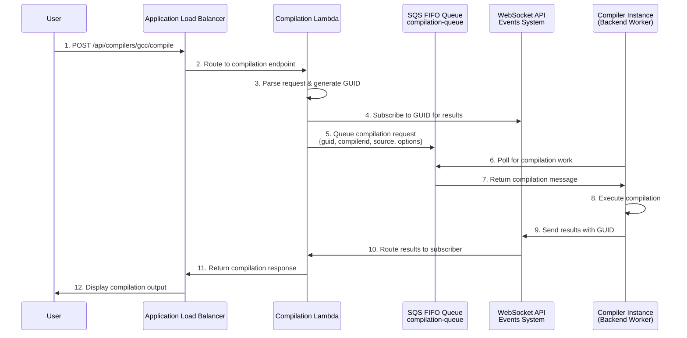
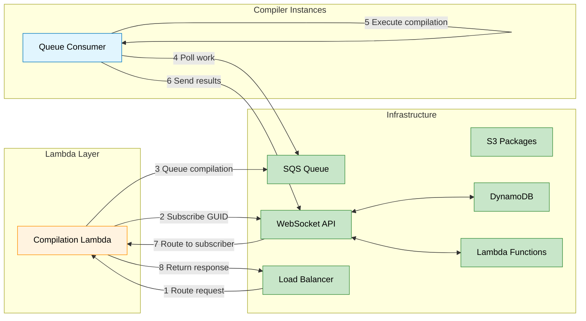

# Lambda-Based Compilation Workflow and Architecture

## Overview

Compiler Explorer has implemented a **Lambda-based compilation endpoint system** that intercepts compilation requests and routes them through an asynchronous queue-based workflow. This new architecture replaces direct ALB-to-instance routing for compilation endpoints, enabling better scalability, reliability, and workload distribution.

Unlike the traditional model where compilation requests hit instances directly, the Lambda system creates a **buffer layer** that queues compilation requests and waits for results via WebSocket connections, providing more resilient request handling.

This document describes the complete workflow, architecture, and operational model for Lambda-based compilation in Compiler Explorer.

## Simplified Use-Case Flow



### Key Interactions Explained

1. **User → ALB**: User submits code for compilation via standard REST API
2. **ALB → Lambda**: Load balancer routes compilation requests to Lambda function
3. **Lambda → WebSocket**: Subscribes to unique GUID to receive compilation results
4. **Lambda → SQS**: Queues compilation request with GUID and all necessary context
5. **Instance → SQS**: Backend instances poll queue for compilation work
6. **Instance → Local**: Executes compilation using existing compiler infrastructure
7. **Instance → WebSocket**: Sends compilation results with GUID
8. **WebSocket → Lambda**: Routes results back to waiting Lambda function
9. **Lambda → User**: Returns compilation output in expected format

## Architecture Comparison

### Traditional Direct-Route Model

```
┌─────────────────────────────────────────────────────────────────────────┐
│                     Traditional Direct Routing                          │
├─────────────────────────────────────────────────────────────────────────┤
│                                                                         │
│  [User Request] → [ALB] → [Instance] → [Compilation] → [Results]        │
│                     │         │             │                           │
│                     ↓         ↓             ↓                           │
│                [Direct]   [Immediate]   [Synchronous]                   │
│                                                                         │
└─────────────────────────────────────────────────────────────────────────┘
```

### Lambda-Based Queue Model

```
┌─────────────────────────────────────────────────────────────────────────┐
│                      Lambda-Based Queue Architecture                    │
├─────────────────────────────────────────────────────────────────────────┤
│                                                                         │
│ ┌─────────────────────┐                    ┌─────────────────────┐      │
│ │   Lambda Layer      │                    │ Compiler Instances  │      │
│ │  (Request Buffer)   │                    │   (Workers)         │      │
│ ├─────────────────────┤                    ├─────────────────────┤      │
│ │ • Request Parsing   │                    │ • Traditional Setup │      │
│ │ • GUID Generation   │                    │ • Queue Polling     │      │
│ │ • Response Waiting  │◄────WebSocket─────►│ • Result Publishing │      │
│ │ • Content Negotiation│                   │ • Compilation Logic │      │
│ └─────────────────────┘                    └─────────────────────┘      │
│           │                                           ▲                 │
│           ▼                                           │                 │
│ ┌─────────────────────────────────────────────────────────────────────┐ │
│ │                      SQS FIFO Queue                                 │ │
│ │                  compilation-queue-{env}                            │ │
│ └─────────────────────────────────────────────────────────────────────┘ │
│                                                                         │
└─────────────────────────────────────────────────────────────────────────┘
```

## Detailed Component Interactions



## Configuration Details

### Lambda Function Environment Variables

```properties
# Beta Environment Lambda
SQS_QUEUE_URL=https://sqs.us-east-1.amazonaws.com/account/beta-compilation-queue.fifo
WEBSOCKET_URL=wss://events.godbolt.org/beta
RETRY_COUNT=2
TIMEOUT_SECONDS=90
```

### ALB Listener Rules

```terraform
# Active for Beta Environment
resource "aws_alb_listener_rule" "compilation_beta" {
  priority = 10

  condition {
    path_pattern {
      values = [
        "/beta/api/compilers/*/compile",
        "/beta/api/compilers/*/cmake"
      ]
    }
  }

  action {
    type             = "forward"
    target_group_arn = aws_alb_target_group.compilation_lambda_beta.arn
  }
}
```

### Instance Queue Consumer Configuration

```properties
# Instances poll same compilation queues
compilation.queue_url=https://sqs.us-east-1.amazonaws.com/account/beta-compilation-queue.fifo
compilation.consumer_enabled=true
compilation.polling_interval=100ms
compilation.concurrent_workers=2
```

## Complete Compilation Workflow

### 1. User Submits Compilation Request

```
┌─────────────────────────────────────────────────────────────────────────┐
│                        Step 1: User Request                             │
├─────────────────────────────────────────────────────────────────────────┤
│                                                                         │
│  User compiles C++ code via standard API:                               │
│  • POST /beta/api/compilers/gcc/compile                                 │
│  • Content-Type: application/json or text/plain                         │
│  • Accept: application/json or text/plain                               │
│  • Body: {"source": "int main(){}", "options": {...}}                   │
│                                                                         │
│  Request routed by: ALB listener rule (priority 10)                     │
│  Target: Lambda function (compilation-beta)                             │
│                                                                         │
└─────────────────────────────────────────────────────────────────────────┘
```

### 2. Lambda Request Processing

```
┌─────────────────────────────────────────────────────────────────────────┐
│                    Step 2: Lambda Request Handling                      │
├─────────────────────────────────────────────────────────────────────────┤
│                                                                         │
│  Lambda function execution:                                             │
│  1. Parse ALB event to extract request details                          │
│  2. Extract compiler ID from path: /api/compilers/{gcc}/compile         │
│  3. Parse request body (JSON or plain text)                             │
│  4. Store Accept header for response formatting                         │
│  5. Generate unique GUID for request tracking                           │
│                                                                         │
│  Request parsing logic:                                                 │
│  • JSON requests: Parse full options object                             │
│  • Plain text: Wrap as {"source": body}                                 │
│  • Headers preserved for downstream processing                          │
│                                                                         │
│  Key decision points:                                                   │
│  • Content-Type determines parsing strategy                             │
│  • Accept header determines response format                             │
│  • Path pattern extracts compiler identifier                            │
│                                                                         │
└─────────────────────────────────────────────────────────────────────────┘
```

### 3. WebSocket Subscription Setup

```
┌─────────────────────────────────────────────────────────────────────────┐
│                  Step 3: WebSocket Result Subscription                  │
├─────────────────────────────────────────────────────────────────────────┤
│                                                                         │
│  Lambda establishes WebSocket connection:                               │
│                                                                         │
│  1. Connect to: wss://events.godbolt.org/beta                           │
│  2. Send subscription message:                                          │
│     {                                                                   │
│       "type": "subscribe",                                              │
│       "guid": "abc123def-456-789..."                                    │
│     }                                                                   │
│  3. Configure timeout: 90 seconds (configurable)                        │
│  4. Setup retry logic: 2 attempts (configurable)                        │
│                                                                         │
│  WebSocket connection management:                                       │
│  • Automatic reconnection on connection failure                         │
│  • Timeout handling for unresponsive connections                        │
│  • Error logging for debugging purposes                                 │
│                                                                         │
└─────────────────────────────────────────────────────────────────────────┘
```

### 4. SQS Message Submission

```
┌─────────────────────────────────────────────────────────────────────────┐
│                     Step 4: SQS Queue Submission                        │
├─────────────────────────────────────────────────────────────────────────┤
│                                                                         │
│  Compilation request queued:                                            │
│                                                                         │
│  Queue: beta-compilation-queue.fifo                                     │
│  Message structure:                                                     │
│  {                                                                      │
│    "guid": "abc123def-456-789...",                                      │
│    "compiler_id": "gcc",                                                │
│    "endpoint": "compile",                                               │
│    "request_body": {                                                    │
│      "source": "int main() { return 0; }",                              │
│      "options": {                                                       │
│        "userArguments": "-O2",                                          │
│        "compilerOptions": {},                                           │
│        "filters": {...}                                                 │
│      }                                                                  │
│    },                                                                   │
│    "headers": {                                                         │
│      "Accept": "application/json",                                      │
│      "Content-Type": "application/json"                                 │
│    },                                                                   │
│    "timestamp": "2024-01-01T00:00:00Z"                                  │
│  }                                                                      │
│                                                                         │
│  FIFO properties:                                                       │
│  • MessageGroupId: "default"                                            │
│  • MessageDeduplicationId: hash(message content)                        │
│  • VisibilityTimeout: 2 minutes                                         │
│  • MessageRetention: 30 minutes                                         │
│                                                                         │
└─────────────────────────────────────────────────────────────────────────┘
```

### 5. Instance Message Processing

```
┌─────────────────────────────────────────────────────────────────────────┐
│                   Step 5: Instance Queue Processing                     │
├─────────────────────────────────────────────────────────────────────────┤
│                                                                         │
│  Compiler instance receives message:                                    │
│                                                                         │
│  1. Queue consumer polls SQS every 100ms                                │
│  2. Receives compilation message from queue                             │
│  3. Extract: guid, compiler_id, request_body, headers                   │
│  4. Delete message from queue (prevents reprocessing)                   │
│                                                                         │
│  Compilation execution:                                                 │
│  1. Load compiler configuration for compiler_id                         │
│  2. Setup compilation environment                                       │
│  3. Execute compilation with provided source/options                    │
│  4. Capture output: stdout, stderr, exit code                           │
│  5. Apply any filters or transformations                                │
│                                                                         │
│  Standard Compiler Explorer flow:                                       │
│  • Uses existing compiler infrastructure                                │
│  • Same filtering and output processing                                 │
│  • No changes to compilation logic                                      │
│                                                                         │
└─────────────────────────────────────────────────────────────────────────┘
```

### 6. Result Publication via WebSocket

```
┌─────────────────────────────────────────────────────────────────────────┐
│                    Step 6: Result Publication                           │
├─────────────────────────────────────────────────────────────────────────┤
│                                                                         │
│  Instance publishes compilation results:                                │
│                                                                         │
│  1. Connect to WebSocket: wss://events.godbolt.org/beta                 │
│  2. Send result message:                                                │
│                                                                         │
│     {                                                                   │
│       "guid": "abc123def-456-789...",                                   │
│       "code": 0,                                                        │
│       "stdout": [{"text": "#include <iostream>..."}],                   │
│       "stderr": [],                                                     │
│       "asm": [                                                          │
│         {"text": "main:", "line": 1},                                   │
│         {"text": "  push rbp", "line": 2},                              │
│         {"text": "  mov rbp, rsp", "line": 3}                           │
│       ],                                                                │
│       "compileTime": 1250,                                              │
│       "compilationOptions": ["-O2"],                                    │
│       "tools": [],                                                      │
│       "okToCache": true                                                 │
│     }                                                                   │
│                                                                         │
│  WebSocket infrastructure:                                              │
│  • AWS API Gateway + Lambda routing                                     │
│  • DynamoDB subscription tracking                                       │
│  • Automatic message delivery to subscribers                            │
│                                                                         │
└─────────────────────────────────────────────────────────────────────────┘
```

### 7. Lambda Response Processing

```
┌─────────────────────────────────────────────────────────────────────────┐
│                    Step 7: Lambda Response Handling                     │
├─────────────────────────────────────────────────────────────────────────┤
│                                                                         │
│  Lambda receives and processes results:                                 │
│                                                                         │
│  1. WebSocket client receives message with matching GUID                │
│  2. Parse compilation result JSON                                       │
│  3. Apply content negotiation based on Accept header:                   │
│                                                                         │
│     Accept: application/json (default):                                 │
│     • Return full compilation result object                             │
│     • Include asm, stdout, stderr, metadata                             │
│     • Content-Type: application/json                                    │
│                                                                         │
│     Accept: text/plain:                                                 │
│     • Extract assembly text from asm array                              │
│     • Return plain text assembly only                                   │
│     • Content-Type: text/plain                                          │
│                                                                         │
│  4. Close WebSocket connection                                          │
│  5. Return HTTP response to ALB                                         │
│                                                                         │
│  Error handling:                                                        │
│  • Timeout: Return 408 Request Timeout                                  │
│  • WebSocket failure: Return 503 Service Unavailable                    │
│  • Compilation errors: Return 200 with error details                    │
│                                                                         │
└─────────────────────────────────────────────────────────────────────────┘
```

### 8. User Response and Display

```
┌─────────────────────────────────────────────────────────────────────────┐
│                       Step 8: User Response                             │
├─────────────────────────────────────────────────────────────────────────┤
│                                                                         │
│  ALB returns response to user:                                          │
│                                                                         │
│  HTTP 200 OK                                                            │
│  Content-Type: application/json                                         │
│  Content-Length: 1234                                                   │
│                                                                         │
│  {                                                                      │
│    "code": 0,                                                           │
│    "stdout": [],                                                        │
│    "stderr": [],                                                        │
│    "asm": [                                                             │
│      {"text": "main:", "line": 1},                                      │
│      {"text": "  push rbp", "line": 2},                                 │
│      {"text": "  mov rbp, rsp", "line": 3},                             │
│      {"text": "  xor eax, eax", "line": 4},                             │
│      {"text": "  pop rbp", "line": 5},                                  │
│      {"text": "  ret", "line": 6}                                       │
│    ],                                                                   │
│    "compileTime": 1250,                                                 │
│    "okToCache": true                                                    │
│  }                                                                      │
│                                                                         │
│  User experience:                                                       │
│  • Same API response format as traditional model                        │
│  • Transparent queue-based processing                                   │
│  • Enhanced reliability through async architecture                      │
│                                                                         │
└─────────────────────────────────────────────────────────────────────────┘
```

## Component Deep Dive

### Lambda Function Architecture

**Request Processing Pipeline:**

The Lambda function implements a sophisticated request handling pipeline:

1. **ALB Event Parsing**: Extracts HTTP method, path, headers, and body from ALB event
2. **Compiler ID Extraction**: Uses regex to extract compiler identifier from URL path
3. **Content Negotiation**: Supports both JSON and plain text request/response formats
4. **WebSocket Management**: Establishes subscription before queuing request
5. **Response Formatting**: Applies Accept header-based content negotiation

**Environment-Specific Configuration:**

| Environment | Lambda Function | SQS Queue | WebSocket URL |
|-------------|-----------------|-----------|---------------|
| **Beta** | `compilation-beta` | `beta-compilation-queue.fifo` | `wss://events.godbolt.org/beta` |
| **Staging** | `compilation-staging` | `staging-compilation-queue.fifo` | `wss://events.godbolt.org/staging` |
| **Production** | `compilation-prod` | `prod-compilation-queue.fifo` | `wss://events.godbolt.org/` |

### SQS Queue Architecture

**Queue Characteristics:**

- **FIFO Ordering**: Ensures compilation requests are processed in submission order
- **Exactly-Once Delivery**: Prevents duplicate compilation attempts
- **Message Deduplication**: Based on content hash to avoid duplicate work
- **Visibility Timeout**: 2 minutes for message processing
- **Message Retention**: 30 minutes for unprocessed messages

**Message Structure Standardization:**

All compilation messages follow a consistent schema:

```json
{
  "guid": "unique-request-identifier",
  "compiler_id": "extracted-from-url-path",
  "endpoint": "compile|cmake",
  "request_body": "original-request-body",
  "headers": "preserved-request-headers",
  "timestamp": "iso-8601-timestamp"
}
```

### WebSocket Communication

**Bidirectional Communication Model:**

1. **Lambda → WebSocket**: Subscribes to GUID, waits for results
2. **Instance → WebSocket**: Publishes compilation results with GUID
3. **WebSocket → Lambda**: Routes results to appropriate subscribers

**Connection Management:**

- **Automatic Retry**: Configurable retry count for failed connections
- **Timeout Handling**: 90-second timeout for compilation results
- **Connection Cleanup**: Automatic disconnection after result delivery

### Content Negotiation System

**Request Format Handling:**

| Content-Type | Processing Strategy |
|--------------|-------------------|
| `application/json` | Parse as JSON object |
| `text/plain` | Wrap as `{"source": body}` |
| *Missing/Other* | Treat as plain text |

**Response Format Selection:**

| Accept Header | Response Format |
|---------------|-----------------|
| `application/json` | Full compilation result object |
| `text/plain` | Assembly text only |
| *Missing/Other* | Default to JSON |

## Operational Characteristics

### Performance Benefits

**Improved Scalability:**

- **Request Buffering**: Lambda handles traffic spikes through queue buffering
- **Worker Isolation**: Compilation instances focus solely on compilation work
- **Horizontal Scaling**: Independent scaling of request handling and compilation
- **Load Distribution**: Even workload distribution across available instances

**Enhanced Reliability:**

- **Fault Tolerance**: Queue persistence survives instance failures
- **Retry Capability**: Built-in retry logic for transient failures
- **Graceful Degradation**: Timeout handling prevents indefinite hangs
- **Isolation Benefits**: Request processing isolated from compilation environment

### Deployment Strategy

**Environment Rollout:**

1. **Beta Environment**: Active deployment for testing and validation
2. **Staging Environment**: Infrastructure ready, listener rules disabled
3. **Production Environment**: Infrastructure provisioned, awaiting activation

**Gradual Migration Approach:**

- **ALB Listener Rules**: Easily toggled for traffic routing
- **Blue-Green Compatible**: Works with existing blue-green deployment model
- **Rollback Capability**: Simple rule disabling reverts to direct routing

### Monitoring and Observability

**CloudWatch Metrics:**

- **Lambda Metrics**: Invocation count, duration, error rate, timeout rate
- **SQS Metrics**: Message count, age of oldest message, receive count
- **WebSocket Metrics**: Connection count, message delivery success rate

**Log Aggregation:**

- **Lambda Logs**: Request processing, WebSocket communication, error details
- **Instance Logs**: Queue polling, compilation execution, result publishing
- **WebSocket Logs**: Connection lifecycle, message routing, subscription management

## Error Handling and Edge Cases

### Failure Scenarios

**Lambda Function Failures:**

1. **Timeout During Compilation**: Return 408 Request Timeout with descriptive message
2. **WebSocket Connection Failure**: Retry with exponential backoff, eventual 503 error
3. **SQS Queue Failure**: Return 503 Service Unavailable with retry guidance
4. **Memory/Resource Limits**: Scale function resources, implement request throttling

**Queue Processing Failures:**

1. **Message Parsing Errors**: Log error, delete message, send error result via WebSocket
2. **Compiler Not Found**: Return compilation error with appropriate message
3. **Compilation Timeout**: Kill process, return timeout error via WebSocket
4. **WebSocket Publishing Failure**: Log error, continue processing (fire-and-forget)

**Network and Infrastructure Failures:**

1. **WebSocket Infrastructure Outage**: Lambda timeouts, return 503 to users
2. **SQS Service Degradation**: Request queuing delays, eventual timeout
3. **Instance Connectivity Issues**: Message visibility timeout, automatic retry
4. **Cross-AZ Communication Latency**: Increased end-to-end response times

### Recovery Mechanisms

**Automatic Recovery:**

- **Queue Message Redelivery**: Unprocessed messages automatically redelivered
- **Lambda Auto-Retry**: Built-in retry for transient Lambda failures
- **WebSocket Reconnection**: Automatic reconnection on connection drops
- **Instance Auto-Scaling**: Failed instances replaced automatically

**Operational Recovery:**

- **Manual Queue Purging**: Clear stuck messages during maintenance
- **Lambda Function Restart**: Redeploy function for persistent issues
- **Traffic Routing**: Disable Lambda rules, revert to direct routing
- **Queue Drain Mode**: Process existing messages without accepting new ones

## Integration with Existing Systems

### Blue-Green Deployment Compatibility

**Queue Sharing Model:**

Both blue and green environments share the same compilation queues:
- **Beta**: `beta-compilation-queue.fifo`
- **Staging**: `staging-compilation-queue.fifo`
- **Production**: `prod-compilation-queue.fifo`

**Deployment Scenarios:**

1. **Pre-Deployment**: Blue instances handle all compilation work
2. **During Deployment**: Both blue and green instances process same queue
3. **Post-Deployment**: Green instances handle new requests, blue remains standby
4. **Rollback**: Traffic routing reverted, blue instances resume primary role

### Compiler Infrastructure Integration

**Seamless Backend Integration:**

- **No Compiler Changes**: Existing compiler configurations unchanged
- **Same Output Formats**: Identical compilation result structures
- **Filter Compatibility**: All existing filters and transformations preserved
- **Tool Integration**: Compiler tools (objdump, readelf, etc.) work unchanged

**Queue Consumer Implementation:**

Backend instances implement queue consumers alongside existing HTTP handlers:
- **Parallel Processing**: HTTP and queue requests processed simultaneously
- **Shared Resources**: Same compiler pool serves both request types
- **Configuration Reuse**: Existing compiler configurations apply to queue work
- **Logging Integration**: Queue processing logged alongside HTTP requests

## Future Enhancements

### Potential Improvements

1. **Priority Queues**: Different priority levels for premium users or urgent requests
2. **Batch Processing**: Group multiple small compilations for efficiency
3. **Result Caching**: Cache compilation results in DynamoDB for duplicate requests
4. **Metrics Collection**: Enhanced telemetry for performance optimization
5. **Geographic Distribution**: Regional queues for reduced latency

### Scaling Optimizations

1. **Dynamic Timeout Adjustment**: Adaptive timeouts based on queue depth
2. **Predictive Scaling**: Scale instances based on queue growth trends
3. **Cost Optimization**: Spot instance integration for cost-effective compilation
4. **Resource Right-Sizing**: Optimize Lambda memory and timeout based on usage patterns

This Lambda-based compilation architecture provides a more robust, scalable, and maintainable approach to handling compilation requests while maintaining full compatibility with existing Compiler Explorer functionality and user experience.
