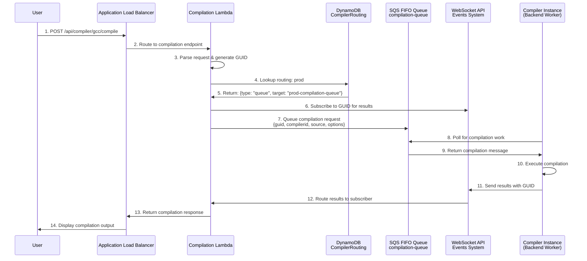
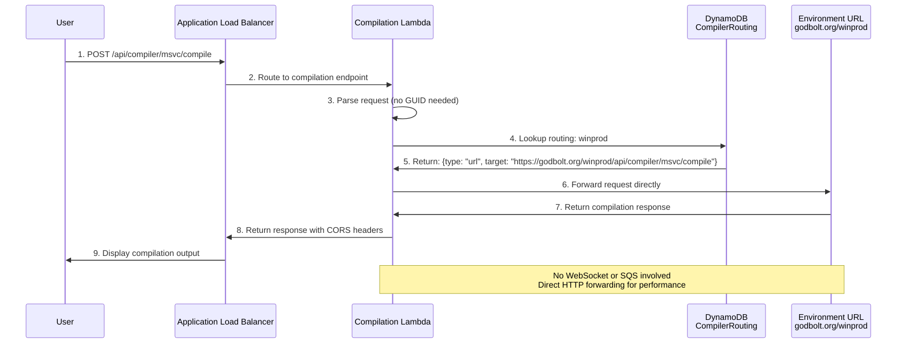
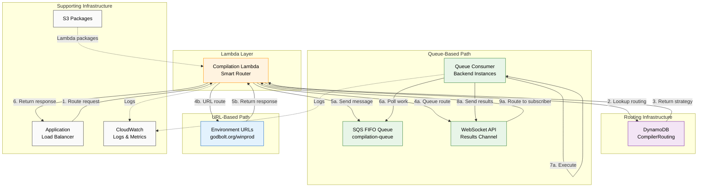
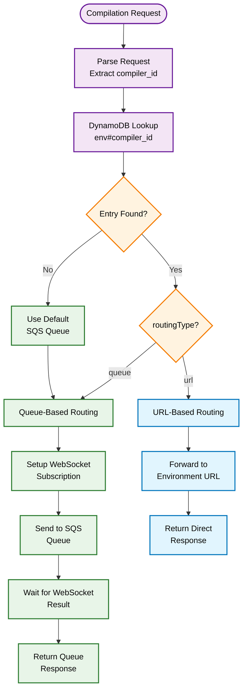

# Lambda-Based Compilation Workflow and Architecture

## Overview

Compiler Explorer has implemented a **Lambda-based compilation endpoint system** with **hybrid routing architecture** that intelligently routes compilation requests based on environment-specific strategies. This system replaces direct ALB-to-instance routing for compilation endpoints, enabling better scalability, reliability, and workload distribution.

The new architecture supports two routing strategies:
- **Queue-based routing**: For standard environments (prod, staging, beta) using SQS queues with WebSocket result delivery
- **Direct URL forwarding**: For specialized environments (gpu, winprod, winstaging, wintest, aarch64prod, aarch64staging, runner) that forward requests directly to environment URLs

Unlike the traditional model where compilation requests hit instances directly, the Lambda system creates a **smart routing layer** that uses a DynamoDB routing table with environment-isolated composite keys to make routing decisions, preventing cross-environment conflicts while supporting diverse deployment architectures.

This document describes the complete workflow, hybrid routing architecture, and operational model for Lambda-based compilation in Compiler Explorer.

## Hybrid Routing Architecture Flow

### Queue-Based Routing (Most Environments)



### Direct URL Forwarding (Windows Environments)



### Key Interactions Explained

#### Queue-Based Routing Flow:
1. **User → ALB**: User submits code for compilation via standard REST API
2. **ALB → Lambda**: Load balancer routes compilation requests to Lambda function  
3. **Lambda → DynamoDB**: Looks up routing strategy using environment-prefixed composite key (e.g., `prod#gcc`)
4. **DynamoDB → Lambda**: Returns routing decision: `{type: "queue", target: "prod-compilation-queue"}`
5. **Lambda → WebSocket**: Subscribes to unique GUID to receive compilation results (BEFORE sending to SQS)
6. **Lambda → SQS**: Queues compilation request with GUID and all necessary context
7. **Instance → SQS**: Backend instances poll queue for compilation work
8. **Instance → Local**: Executes compilation using existing compiler infrastructure
9. **Instance → WebSocket**: Sends compilation results with GUID
10. **WebSocket → Lambda**: Routes results back to waiting Lambda function
11. **Lambda → User**: Returns compilation output in expected format

#### Direct URL Forwarding Flow:
1. **User → ALB**: User submits code for compilation via standard REST API
2. **ALB → Lambda**: Load balancer routes compilation requests to Lambda function
3. **Lambda → DynamoDB**: Looks up routing strategy using environment-prefixed composite key (e.g., `winprod#msvc`)
4. **DynamoDB → Lambda**: Returns routing decision: `{type: "url", target: "https://godbolt.org/winprod/api/compiler/msvc/compile"}`
5. **Lambda → Environment URL**: Forwards request directly to target environment with original headers and body
6. **Environment URL → Lambda**: Returns compilation response (success or error)
7. **Lambda → User**: Returns response with appropriate CORS headers and formatting

## Routing Decision System

### DynamoDB CompilerRouting Table

The Lambda function uses a DynamoDB table to determine how to route each compilation request. This table provides environment isolation and supports hybrid routing strategies.

**Table Structure:**
- **Primary Key**: `compilerId` (composite key format: `environment#compiler_id`)
- **Attributes**: `queueName`, `environment`, `routingType`, `targetUrl`, `lastUpdated`

**Composite Key Benefits:**
- **Environment Isolation**: Prevents cross-environment routing conflicts
- **Multi-Environment Support**: Single table serves all environments (prod, staging, beta, winprod, etc.)
- **Backward Compatibility**: Legacy entries (without environment prefix) are supported during migration

**Example Entries:**

| compilerId | queueName | environment | routingType | targetUrl |
|------------|-----------|-------------|-------------|-----------|
| `prod#gcc-trunk` | `prod-compilation-queue` | `prod` | `queue` | `` |
| `winprod#msvc-19` | `` | `winprod` | `url` | `https://godbolt.org/winprod/api/compiler/msvc-19/compile` |
| `gpu#nvcc-12` | `` | `gpu` | `url` | `https://godbolt.org/gpu/api/compiler/nvcc-12/compile` |

### Environment Routing Strategies

The system supports different routing strategies based on environment characteristics:

**Queue Environments** (SQS + WebSocket):
- `prod`, `staging`, `beta` → Standard compilation queue routing

**URL Environments** (Direct HTTP forwarding):
- `winprod`, `winstaging`, `wintest` → Windows-specific direct forwarding
- `gpu` → GPU compilation environment forwarding
- `aarch64prod`, `aarch64staging` → ARM64-specific direct forwarding  
- `runner` → CI/testing environment forwarding

**Routing Decision Logic:**
```
if (routingType === "url") {
    // Direct URL forwarding - no WebSocket/SQS needed
    forward_to_environment_url(targetUrl)
} else {
    // Queue-based routing - use WebSocket for results
    subscribe_to_websocket(guid)
    send_to_sqs_queue(queueName, compilation_request)
    wait_for_websocket_result(guid)
}
```

### Environment Context in Lambda

Each Lambda deployment includes `ENVIRONMENT_NAME` to provide routing context:
- **Environment Variable**: `ENVIRONMENT_NAME=prod|staging|beta|winprod|gpu|etc.`
- **Composite Key Construction**: `${ENVIRONMENT_NAME}#${compiler_id}`
- **Fallback Strategy**: If composite key not found, try legacy format for backward compatibility

## Architecture Comparison

### Traditional Direct-Route Model

```
┌─────────────────────────────────────────────────────────────────────────┐
│                     Traditional Direct Routing                          │
├─────────────────────────────────────────────────────────────────────────┤
│                                                                         │
│  [User Request] → [ALB] → [Instance] → [Compilation] → [Results]        │
│                     │         │             │                           │
│                     ↓         ↓             ↓                           │
│                [Direct]   [Immediate]   [Synchronous]                   │
│                                                                         │
└─────────────────────────────────────────────────────────────────────────┘
```

### Hybrid Lambda Routing Model

```
┌─────────────────────────────────────────────────────────────────────────┐
│                      Hybrid Lambda Routing Architecture                 │
├─────────────────────────────────────────────────────────────────────────┤
│                                                                         │
│ ┌─────────────────────┐     ┌─────────────────────┐                     │
│ │   Lambda Layer      │     │   DynamoDB Table    │                     │
│ │  (Smart Router)     │────►│  CompilerRouting    │                     │
│ ├─────────────────────┤     ├─────────────────────┤                     │
│ │ • Request Parsing   │     │ • Composite Keys    │                     │
│ │ • Environment Lookup│     │ • Environment Isolation                   │
│ │ • Routing Decision  │     │ • Hybrid Strategies │                     │
│ │ • Response Handling │     │ • Legacy Support    │                     │
│ └─────────────┬───────┘     └─────────────────────┘                     │
│               │                                                         │
│               ▼                                                         │
│ ┌─────────────────────────────────────────────────────────────────────┐ │
│ │                    ROUTING DECISION                                 │ │
│ └─────────────┬───────────────────────────────────┬───────────────────┘ │
│               │                                   │                     │
│               ▼                                   ▼                     │
│ ┌─────────────────────┐                 ┌─────────────────────┐         │
│ │   Queue Routing     │                 │   URL Routing       │         │
│ │  (prod, staging,    │                 │  (winprod, wintest) │         │
│ │   beta, gpu)        │                 │                     │         │
│ ├─────────────────────┤                 ├─────────────────────┤         │
│ │ • WebSocket Setup   │                 │ • Direct Forward    │         │
│ │ • SQS Queue Send    │                 │ • HTTP Proxy        │         │
│ │ • Result Waiting    │                 │ • CORS Headers      │         │
│ │ • Backend Workers   │                 │ • Error Passthrough │         │
│ └─────────────────────┘                 └─────────────────────┘         │
│           │                                           │                 │
│           ▼                                           ▼                 │
│ ┌─────────────────────┐                 ┌─────────────────────┐         │
│ │   SQS FIFO Queue    │                 │  Environment URLs   │         │
│ │ {env}-compilation-  │                 │ godbolt.org/winprod │         │
│ │       queue         │                 │ godbolt.org/wintest │         │
│ └─────────────────────┘                 └─────────────────────┘         │
│                                                                         │
└─────────────────────────────────────────────────────────────────────────┘
```

## Detailed Component Interactions



## Configuration Details

### Lambda Function Environment Variables

The Lambda function now includes `ENVIRONMENT_NAME` for routing context and DynamoDB integration:

```properties
# Production Environment Lambda
SQS_QUEUE_URL=https://sqs.us-east-1.amazonaws.com/account/prod-compilation-queue.fifo
WEBSOCKET_URL=wss://events.godbolt.org/
ENVIRONMENT_NAME=prod
RETRY_COUNT=2
TIMEOUT_SECONDS=90

# Windows Production Environment Lambda  
SQS_QUEUE_URL=https://sqs.us-east-1.amazonaws.com/account/winprod-compilation-queue.fifo
WEBSOCKET_URL=wss://events.godbolt.org/winprod
ENVIRONMENT_NAME=winprod
RETRY_COUNT=2
TIMEOUT_SECONDS=90

# Beta Environment Lambda (Testing)
SQS_QUEUE_URL=https://sqs.us-east-1.amazonaws.com/account/beta-compilation-queue.fifo
WEBSOCKET_URL=wss://events.godbolt.org/beta
ENVIRONMENT_NAME=beta
RETRY_COUNT=2
TIMEOUT_SECONDS=90
```

**Key Changes:**
- **`ENVIRONMENT_NAME`**: Used to construct composite keys for DynamoDB routing lookups (e.g., `prod#gcc-trunk`)
- **Environment-Specific URLs**: Each environment has its own SQS queue and WebSocket endpoint
- **Routing Context**: Lambda uses environment name to determine correct routing strategy
- **Hybrid Support**: Same Lambda code supports both queue-based and URL-based routing

### ALB Listener Rules

```terraform
# Active for Beta Environment Only
resource "aws_alb_listener_rule" "compilation_beta" {
  priority = 10

  condition {
    path_pattern {
      values = [
        "/beta/api/compiler/*/compile",
        "/beta/api/compiler/*/cmake"
      ]
    }
  }

  action {
    type             = "forward"
    target_group_arn = aws_alb_target_group.compilation_lambda_beta.arn
  }
}

# Note: Staging and Production environments are currently disabled in Terraform
# configuration for focused beta testing and validation.
```

### Instance Queue Consumer Configuration

```properties
# Instances poll same compilation queues
compilation.queue_url=https://sqs.us-east-1.amazonaws.com/account/beta-compilation-queue.fifo
compilation.consumer_enabled=true
compilation.polling_interval=100ms
compilation.concurrent_workers=2
```

## Routing Management CLI Tools

The system includes comprehensive CLI tools for managing the compiler routing table:

### Available Commands

```bash
# Update routing table for specific environment from live API data
ce --env prod compiler-routing update --dry-run
ce --env winprod compiler-routing update --skip-confirmation

# Show current routing statistics across all environments
ce compiler-routing status

# Look up routing for specific compiler in environment context
ce --env prod compiler-routing lookup gcc-trunk
ce --env winprod compiler-routing lookup msvc-19

# Validate routing table consistency against live API
ce compiler-routing validate --env prod
ce compiler-routing validate  # validates all environments

# Clear routing entries for specific environment
ce compiler-routing clear --env staging --skip-confirmation

# Migrate legacy entries to composite key format
ce compiler-routing migrate
```

### Management Workflow

**Daily Operations:**
1. **Monitor Status**: `ce compiler-routing status` to check table health
2. **Validate Consistency**: `ce compiler-routing validate` to identify drift
3. **Update from API**: `ce --env prod compiler-routing update` after compiler deployments

**Environment Setup:**
1. **Clear Old Data**: `ce compiler-routing clear --env staging`
2. **Populate Fresh**: `ce --env staging compiler-routing update`
3. **Verify Setup**: `ce compiler-routing validate --env staging`

**Migration Support:**
1. **Check Legacy**: `ce compiler-routing status` (shows composite vs legacy entries)
2. **Migrate Data**: `ce compiler-routing migrate` (converts old format to new)
3. **Verify Migration**: `ce compiler-routing validate` (ensures consistency)

### Routing Table Statistics

Current production deployment (as of documentation update):
- **Total Compilers**: 5,156 entries across 3 environments
- **prod**: 4,915 compilers → queue routing (`prod-compilation-queue`)
- **winprod**: 180 compilers → URL routing (`https://godbolt.org/winprod/api/compiler/{id}/compile`)
- **gpu**: 61 compilers → URL routing (`https://godbolt.org/gpu/api/compiler/{id}/compile`)

## Hybrid Routing Decision Visualization



## Complete Compilation Workflow

### 1. User Submits Compilation Request

```
┌─────────────────────────────────────────────────────────────────────────┐
│                        Step 1: User Request                             │
├─────────────────────────────────────────────────────────────────────────┤
│                                                                         │
│  User compiles C++ code via standard API:                               │
│  • POST /beta/api/compiler/gcc/compile                                  │
│  • Content-Type: application/json or text/plain                         │
│  • Accept: application/json or text/plain                               │
│  • Body: {"source": "int main(){}", "options": {...}}                   │
│                                                                         │
│  Request routed by: ALB listener rule (priority 10)                     │
│  Target: Lambda function (compilation-beta)                             │
│                                                                         │
└─────────────────────────────────────────────────────────────────────────┘
```

### 2. Lambda Request Processing

```
┌─────────────────────────────────────────────────────────────────────────┐
│                    Step 2: Lambda Request Handling                      │
├─────────────────────────────────────────────────────────────────────────┤
│                                                                         │
│  Lambda function execution:                                             │
│  1. Parse ALB event to extract request details                          │
│  2. Extract compiler ID from path: /api/compiler/{gcc}/compile          │
│  3. Parse request body (JSON or plain text)                             │
│  4. Store Accept header for response formatting                         │
│  5. Generate unique GUID for request tracking                           │
│                                                                         │
│  Request parsing logic:                                                 │
│  • JSON requests: Parse full options object                             │
│  • Plain text: Wrap as {"source": body}                                 │
│  • Headers preserved for downstream processing                          │
│                                                                         │
│  Key decision points:                                                   │
│  • Content-Type determines parsing strategy                             │
│  • Accept header determines response format                             │
│  • Path pattern extracts compiler identifier                            │
│                                                                         │
└─────────────────────────────────────────────────────────────────────────┘
```

### 3. WebSocket Subscription Setup

```
┌─────────────────────────────────────────────────────────────────────────┐
│                  Step 3: WebSocket Result Subscription                  │
├─────────────────────────────────────────────────────────────────────────┤
│                                                                         │
│  Lambda establishes WebSocket connection:                               │
│                                                                         │
│  1. Connect to: wss://events.godbolt.org/beta                           │
│  2. Send subscription message:                                          │
│     subscribe: abc123def-456-789...                                     │
│  3. Configure timeout: 90 seconds (configurable)                        │
│  4. Setup retry logic: 2 attempts (configurable)                        │
│                                                                         │
│  WebSocket connection management:                                       │
│  • Automatic reconnection on connection failure                         │
│  • Timeout handling for unresponsive connections                        │
│  • Error logging for debugging purposes                                 │
│                                                                         │
└─────────────────────────────────────────────────────────────────────────┘
```

### 4. SQS Message Submission

```
┌─────────────────────────────────────────────────────────────────────────┐
│                     Step 4: SQS Queue Submission                        │
├─────────────────────────────────────────────────────────────────────────┤
│                                                                         │
│  Compilation request queued:                                            │
│                                                                         │
│  Queue: beta-compilation-queue.fifo                                     │
│  Message structure:                                                     │
│  {                                                                      │
│    "guid": "abc123def-456-789...",                                      │
│    "compilerId": "gcc",                                                 │
│    "isCMake": false,                                                    │
│    "headers": {                                                         │
│      "Accept": "application/json",                                      │
│      "Content-Type": "application/json"                                 │
│    },                                                                   │
│    "source": "int main() { return 0; }",                               │
│    "options": ["-O2"],                                                  │
│    "filters": {},                                                       │
│    "backendOptions": {},                                                │
│    "tools": [],                                                         │
│    "libraries": [],                                                     │
│    "files": [],                                                         │
│    "executeParameters": {}                                              │
│  }                                                                      │
│                                                                         │
│  FIFO properties:                                                       │
│  • MessageGroupId: "default"                                            │
│  • MessageDeduplicationId: hash(message content)                        │
│  • VisibilityTimeout: 2 minutes                                         │
│  • MessageRetention: 30 minutes                                         │
│                                                                         │
└─────────────────────────────────────────────────────────────────────────┘
```

### 5. Instance Message Processing

```
┌─────────────────────────────────────────────────────────────────────────┐
│                   Step 5: Instance Queue Processing                     │
├─────────────────────────────────────────────────────────────────────────┤
│                                                                         │
│  Compiler instance receives message:                                    │
│                                                                         │
│  1. Queue consumer polls SQS every 100ms                                │
│  2. Receives compilation message from queue                             │
│  3. Extract: guid, compilerId, source, options, headers                │
│  4. Delete message from queue (prevents reprocessing)                   │
│                                                                         │
│  Compilation execution:                                                 │
│  1. Load compiler configuration for compiler_id                         │
│  2. Setup compilation environment                                       │
│  3. Execute compilation with provided source/options                    │
│  4. Capture output: stdout, stderr, exit code                           │
│  5. Apply any filters or transformations                                │
│                                                                         │
│  Standard Compiler Explorer flow:                                       │
│  • Uses existing compiler infrastructure                                │
│  • Same filtering and output processing                                 │
│  • No changes to compilation logic                                      │
│                                                                         │
└─────────────────────────────────────────────────────────────────────────┘
```

### 6. Result Publication via WebSocket

```
┌─────────────────────────────────────────────────────────────────────────┐
│                    Step 6: Result Publication                           │
├─────────────────────────────────────────────────────────────────────────┤
│                                                                         │
│  Instance publishes compilation results:                                │
│                                                                         │
│  1. Connect to WebSocket: wss://events.godbolt.org/beta                 │
│  2. Send result message:                                                │
│                                                                         │
│     {                                                                   │
│       "guid": "abc123def-456-789...",                                   │
│       "code": 0,                                                        │
│       "stdout": [{"text": "#include <iostream>..."}],                   │
│       "stderr": [],                                                     │
│       "asm": [                                                          │
│         {"text": "main:", "line": 1},                                   │
│         {"text": "  push rbp", "line": 2},                              │
│         {"text": "  mov rbp, rsp", "line": 3}                           │
│       ],                                                                │
│       "compileTime": 1250,                                              │
│       "compilationOptions": ["-O2"],                                    │
│       "tools": [],                                                      │
│       "okToCache": true                                                 │
│     }                                                                   │
│                                                                         │
│  WebSocket infrastructure:                                              │
│  • AWS API Gateway + Lambda routing                                     │
│  • DynamoDB subscription tracking                                       │
│  • Automatic message delivery to subscribers                            │
│                                                                         │
└─────────────────────────────────────────────────────────────────────────┘
```

### 7. Lambda Response Processing

```
┌─────────────────────────────────────────────────────────────────────────┐
│                    Step 7: Lambda Response Handling                     │
├─────────────────────────────────────────────────────────────────────────┤
│                                                                         │
│  Lambda receives and processes results:                                 │
│                                                                         │
│  1. WebSocket client receives message with matching GUID                │
│  2. Parse compilation result JSON                                       │
│  3. Apply content negotiation based on Accept header:                   │
│                                                                         │
│     Accept: application/json (default):                                 │
│     • Return full compilation result object                             │
│     • Include asm, stdout, stderr, metadata                             │
│     • Content-Type: application/json                                    │
│                                                                         │
│     Accept: text/plain:                                                 │
│     • Extract assembly text from asm array                              │
│     • Return plain text assembly only                                   │
│     • Content-Type: text/plain                                          │
│                                                                         │
│  4. Close WebSocket connection                                          │
│  5. Return HTTP response to ALB                                         │
│                                                                         │
│  Error handling:                                                        │
│  • Timeout: Return 408 Request Timeout                                  │
│  • WebSocket failure: Return 503 Service Unavailable                    │
│  • Compilation errors: Return 200 with error details                    │
│                                                                         │
└─────────────────────────────────────────────────────────────────────────┘
```

### 8. User Response and Display

```
┌─────────────────────────────────────────────────────────────────────────┐
│                       Step 8: User Response                             │
├─────────────────────────────────────────────────────────────────────────┤
│                                                                         │
│  ALB returns response to user:                                          │
│                                                                         │
│  HTTP 200 OK                                                            │
│  Content-Type: application/json                                         │
│  Content-Length: 1234                                                   │
│                                                                         │
│  {                                                                      │
│    "code": 0,                                                           │
│    "stdout": [],                                                        │
│    "stderr": [],                                                        │
│    "asm": [                                                             │
│      {"text": "main:", "line": 1},                                      │
│      {"text": "  push rbp", "line": 2},                                 │
│      {"text": "  mov rbp, rsp", "line": 3},                             │
│      {"text": "  xor eax, eax", "line": 4},                             │
│      {"text": "  pop rbp", "line": 5},                                  │
│      {"text": "  ret", "line": 6}                                       │
│    ],                                                                   │
│    "compileTime": 1250,                                                 │
│    "okToCache": true                                                    │
│  }                                                                      │
│                                                                         │
│  User experience:                                                       │
│  • Same API response format as traditional model                        │
│  • Transparent queue-based processing                                   │
│  • Enhanced reliability through async architecture                      │
│                                                                         │
└─────────────────────────────────────────────────────────────────────────┘
```

## Component Deep Dive

### Lambda Function Architecture

**Request Processing Pipeline:**

The Lambda function implements a sophisticated request handling pipeline:

1. **ALB Event Parsing**: Extracts HTTP method, path, headers, and body from ALB event
2. **Compiler ID Extraction**: Uses regex to extract compiler identifier from URL path
3. **Content Negotiation**: Supports both JSON and plain text request/response formats
4. **WebSocket Management**: Establishes subscription before queuing request
5. **Response Formatting**: Applies Accept header-based content negotiation

**Environment-Specific Configuration:**

| Environment | Lambda Function | SQS Queue | WebSocket URL | Status |
|-------------|-----------------|-----------|---------------|--------|
| **Beta** | `compilation-beta` | `beta-compilation-queue.fifo` | `wss://events.godbolt.org/beta` | **Active** |
| **Staging** | `compilation-staging` | `staging-compilation-queue.fifo` | `wss://events.godbolt.org/staging` | *Provisioned (Inactive)* |
| **Production** | `compilation-prod` | `prod-compilation-queue.fifo` | `wss://events.godbolt.org/` | *Provisioned (Inactive)* |

### SQS Queue Architecture

**Queue Characteristics:**

- **FIFO Ordering**: Ensures compilation requests are processed in submission order
- **Exactly-Once Delivery**: Prevents duplicate compilation attempts
- **Message Deduplication**: Based on content hash to avoid duplicate work
- **Visibility Timeout**: 2 minutes for message processing
- **Message Retention**: 30 minutes for unprocessed messages

**Message Structure Standardization:**

All compilation messages follow a consistent schema:

```json
{
  "guid": "unique-request-identifier",
  "compilerId": "extracted-from-url-path",
  "isCMake": false,
  "headers": "preserved-request-headers",
  "source": "int main() { return 0; }",
  "options": ["-O2"],
  "filters": {},
  "backendOptions": {},
  "tools": [],
  "libraries": [],
  "files": [],
  "executeParameters": {}
}
```

### WebSocket Communication

**Bidirectional Communication Model:**

1. **Lambda → WebSocket**: Subscribes to GUID, waits for results
2. **Instance → WebSocket**: Publishes compilation results with GUID
3. **WebSocket → Lambda**: Routes results to appropriate subscribers

**Connection Management:**

- **Automatic Retry**: Configurable retry count for failed connections
- **Timeout Handling**: 90-second timeout for compilation results
- **Connection Cleanup**: Automatic disconnection after result delivery

### Content Negotiation System

**Request Format Handling:**

| Content-Type | Processing Strategy |
|--------------|-------------------|
| `application/json` | Parse as JSON object |
| `text/plain` | Wrap as `{"source": body}` |
| *Missing/Other* | Treat as plain text |

**Response Format Selection:**

| Accept Header | Response Format |
|---------------|-----------------|
| `application/json` | Full compilation result object |
| `text/plain` | Assembly text only |
| *Missing/Other* | Default to JSON |

## Operational Characteristics

### Performance Benefits

**Improved Scalability:**

- **Request Buffering**: Lambda handles traffic spikes through queue buffering
- **Worker Isolation**: Compilation instances focus solely on compilation work
- **Horizontal Scaling**: Independent scaling of request handling and compilation
- **Load Distribution**: Even workload distribution across available instances

**Enhanced Reliability:**

- **Fault Tolerance**: Queue persistence survives instance failures
- **Retry Capability**: Built-in retry logic for transient failures
- **Graceful Degradation**: Timeout handling prevents indefinite hangs
- **Isolation Benefits**: Request processing isolated from compilation environment

### Deployment Strategy

**Environment Rollout:**

1. **Beta Environment**: Active deployment for testing and validation (ALB listener rules enabled)
2. **Staging Environment**: Infrastructure commented out in Terraform, pending beta validation
3. **Production Environment**: Infrastructure commented out in Terraform, pending beta validation

**Gradual Migration Approach:**

- **ALB Listener Rules**: Easily toggled for traffic routing
- **Blue-Green Compatible**: Works with existing blue-green deployment model
- **Rollback Capability**: Simple rule disabling reverts to direct routing

### Monitoring and Observability

**CloudWatch Metrics:**

- **Lambda Metrics**: Invocation count, duration, error rate, timeout rate
- **SQS Metrics**: Message count, age of oldest message, receive count
- **WebSocket Metrics**: Connection count, message delivery success rate

**Log Aggregation:**

- **Lambda Logs**: Error details, warnings, and critical issues only (WARNING level for performance)
- **Instance Logs**: Queue polling, compilation execution, result publishing
- **WebSocket Logs**: Connection lifecycle, message routing, subscription management

**Performance Logging:**

The Lambda function uses WARNING level logging by default to optimize performance:
- Only errors, warnings, and critical issues are logged to CloudWatch
- Verbose request/response details are excluded for faster execution
- Timeout and error conditions are still fully logged for debugging

## Error Handling and Edge Cases

### Failure Scenarios

**Lambda Function Failures:**

1. **Timeout During Compilation**: Return 408 Request Timeout with descriptive message
2. **WebSocket Connection Failure**: Retry with exponential backoff, eventual 503 error
3. **SQS Queue Failure**: Return 503 Service Unavailable with retry guidance
4. **Memory/Resource Limits**: Scale function resources, implement request throttling

**Queue Processing Failures:**

1. **Message Parsing Errors**: Log error, delete message, send error result via WebSocket
2. **Compiler Not Found**: Return compilation error with appropriate message
3. **Compilation Timeout**: Kill process, return timeout error via WebSocket
4. **WebSocket Publishing Failure**: Log error, continue processing (fire-and-forget)

**Network and Infrastructure Failures:**

1. **WebSocket Infrastructure Outage**: Lambda timeouts, return 503 to users
2. **SQS Service Degradation**: Request queuing delays, eventual timeout
3. **Instance Connectivity Issues**: Message visibility timeout, automatic retry
4. **Cross-AZ Communication Latency**: Increased end-to-end response times

### Recovery Mechanisms

**Automatic Recovery:**

- **Queue Message Redelivery**: Unprocessed messages automatically redelivered
- **Lambda Auto-Retry**: Built-in retry for transient Lambda failures
- **WebSocket Reconnection**: Automatic reconnection on connection drops
- **Instance Auto-Scaling**: Failed instances replaced automatically

**Operational Recovery:**

- **Manual Queue Purging**: Clear stuck messages during maintenance
- **Lambda Function Restart**: Redeploy function for persistent issues
- **Traffic Routing**: Disable Lambda rules, revert to direct routing
- **Queue Drain Mode**: Process existing messages without accepting new ones

## Integration with Existing Systems

### Blue-Green Deployment Compatibility

**Queue Sharing Model:**

Both blue and green environments share the same compilation queues:
- **Beta**: `beta-compilation-queue.fifo`
- **Staging**: `staging-compilation-queue.fifo`
- **Production**: `prod-compilation-queue.fifo`

**Deployment Scenarios:**

1. **Pre-Deployment**: Blue instances handle all compilation work
2. **During Deployment**: Both blue and green instances process same queue
3. **Post-Deployment**: Green instances handle new requests, blue remains standby
4. **Rollback**: Traffic routing reverted, blue instances resume primary role

### Compiler Infrastructure Integration

**Seamless Backend Integration:**

- **No Compiler Changes**: Existing compiler configurations unchanged
- **Same Output Formats**: Identical compilation result structures
- **Filter Compatibility**: All existing filters and transformations preserved
- **Tool Integration**: Compiler tools (objdump, readelf, etc.) work unchanged

**Queue Consumer Implementation:**

Backend instances implement queue consumers alongside existing HTTP handlers:
- **Parallel Processing**: HTTP and queue requests processed simultaneously
- **Shared Resources**: Same compiler pool serves both request types
- **Configuration Reuse**: Existing compiler configurations apply to queue work
- **Logging Integration**: Queue processing logged alongside HTTP requests

## Future Enhancements

### Potential Improvements

1. **Priority Queues**: Different priority levels for premium users or urgent requests
2. **Batch Processing**: Group multiple small compilations for efficiency
3. **Result Caching**: Cache compilation results in DynamoDB for duplicate requests
4. **Metrics Collection**: Enhanced telemetry for performance optimization
5. **Geographic Distribution**: Regional queues for reduced latency

### Scaling Optimizations

1. **Dynamic Timeout Adjustment**: Adaptive timeouts based on queue depth
2. **Predictive Scaling**: Scale instances based on queue growth trends
3. **Cost Optimization**: Spot instance integration for cost-effective compilation
4. **Resource Right-Sizing**: Optimize Lambda memory and timeout based on usage patterns

This Lambda-based compilation architecture provides a more robust, scalable, and maintainable approach to handling compilation requests while maintaining full compatibility with existing Compiler Explorer functionality and user experience.
